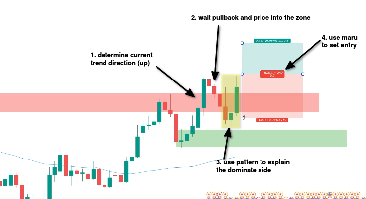
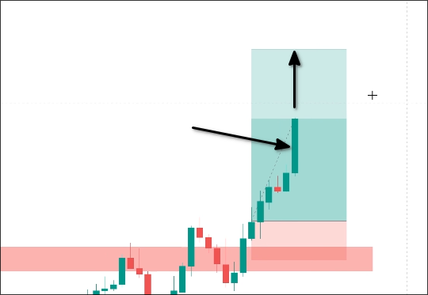
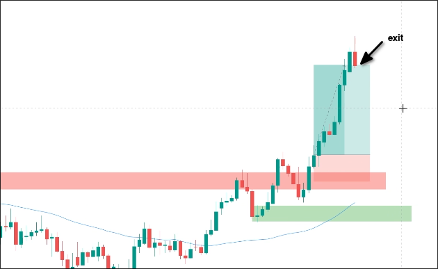
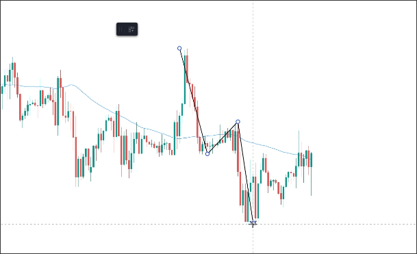
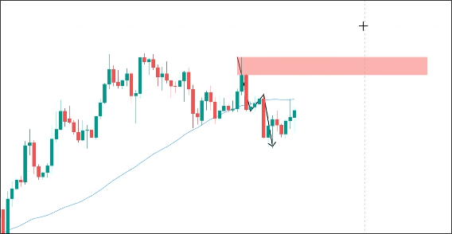
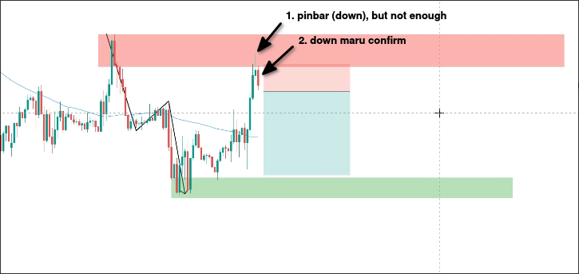

# Examples of using one candle or candle pattern to entry

In the above picture, we have accomplished the following things:
- followed the trend
- waited for a pullback and price into the demand zone
- waited for ONE candle or candle pattern to confirm

If there is no resistance zone above, we should raise the take profit to a risk-reward ratio of 1:3.

Continue to observe the candles after entering.

The above chart shows a big up marubozu candle appearing. Since there is no resistance above, it may be considered to raise the take profit level and continue to observe.

Above, a down pinbar (or special down marubozu) candle appears in the chart, we can profitably exit.

## Example 2

The above is a market structure showing a downtrend lasting 1 hour. You can switch to a higher timeframe to see the trend.

On the 4-hour chart, there is also a clear downward trend, and there is a resistance zone at the high point of the 4-hour chart.

Then we wait for a pullback to occur and enter the resistance zone.

After the price entered the resistance zone, a pinbar with a long upper shadow appeared, but there were two big marubozu candles before that were moving upwards. Therefore, a down pinbar candle may not be confirmed yet. Wait for the second downward marubozu candle to appear, and then you can use it to enter the market.

