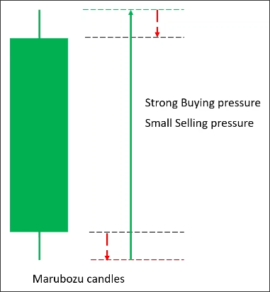
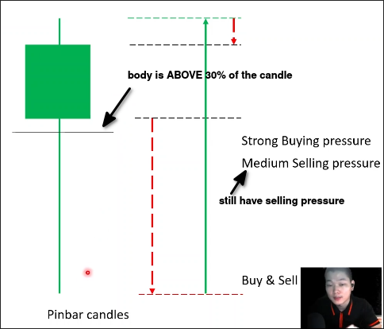
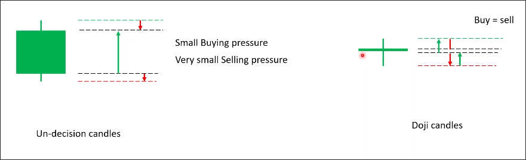
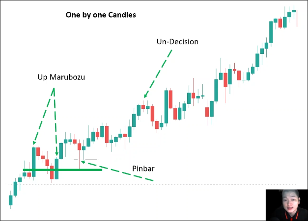
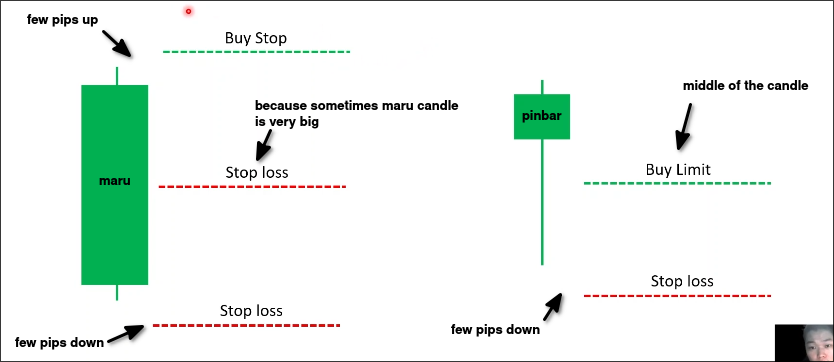
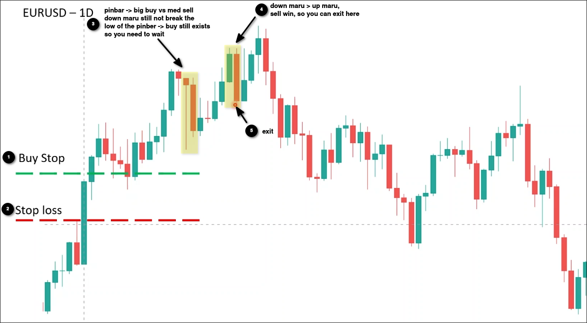
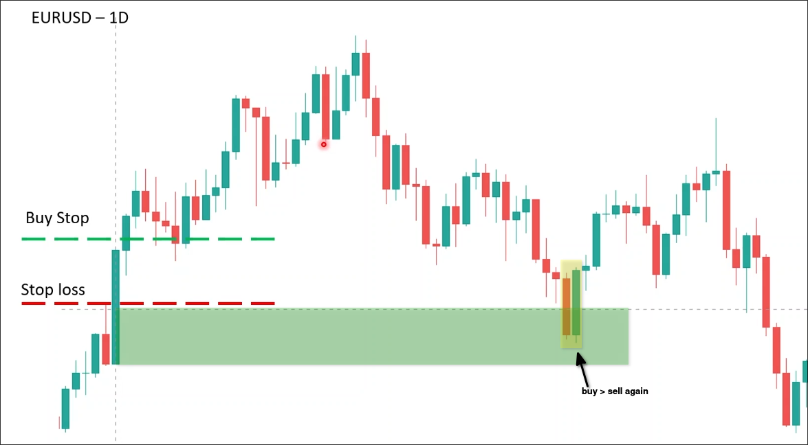

# One candle definitions

## Marubozu

Clearly one side is dominant.

> Compared to level 0 courses, there is no specific requirement here for the body to be larger than 90 candle size, only that the body is large and the tail is small.

## Pinbar

One side is strong, but the other side is still present.

> Compared to the level 0 course, the definition is completely different. In level 0, the definition of a pinbar is a body <= 30 candle size (I guess it is more suitable for determining the range, while the pinbar definition here is more suitable for determining the direction of the market).

## Un-decision & Doji

Means the market now has no enthusiasm to entry, you can skip them.

> compared to level 0 courses is completely different. Here only said that the candle is flat...

We only need to pay attention to the marubozu and pinbar candles.

## Examples

You can see that near the same price range, up marubozu candles and pinbar candles appear multiple times, indicating strong buying pressure near this price range.

## How to buy and sell with one candle

We can use marubozu and pinbar to set entry and stop loss points as above.

> But it is important to note that a single candle is not enough to constitute entry conditions, we need to combine it with the appropriate zone to enter.

### Example

In the above chart, we entered with a large up marubozu candle, and during the process, we pay attention to whether there are marubozu candles or pinbar candles appearing. If they do appear, we use them to analyze the current buying pressure and selling pressure to determine whether to continue holding this position.

In addition, a strong marubozu candle will also create a buying pressure zone or selling pressure zone. When the price returns to this area, buying pressure or selling pressure will appear again.

In the above chart, we can see the price falling back to the buying pressure zone created by the previous big up marubozu candle, and an up marubozu candle appearing to engulf the previous down marubozu candle. At this point, we can use this up marubozu candle as an entry point.

