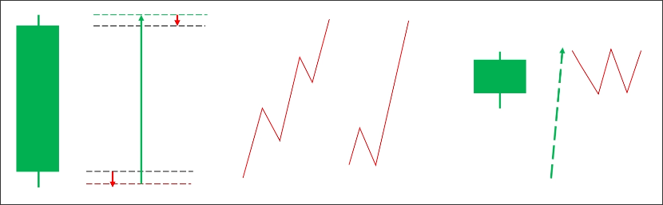
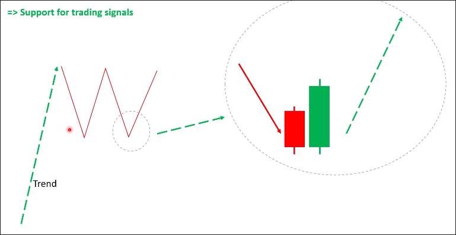

# Why need to understand market patterns?

Market pattern is also called `price pattern`.

## If you need to know more about candlestick patterns

The appearance of a candle pattern at a higher level indicates that a market structure pattern has formed at a smaller level.

## Using candlestick patterns in the market structure pattern

If a two bottom pattern appears in an uptrend, and an engulfing pattern appears at the bottom, this combination has a high probability of continuing the uptrend.

## Bricks

1. Candlestick
2. Price patterns
3. Supply demand
4. Risk management

...

Then, you can build a house.

