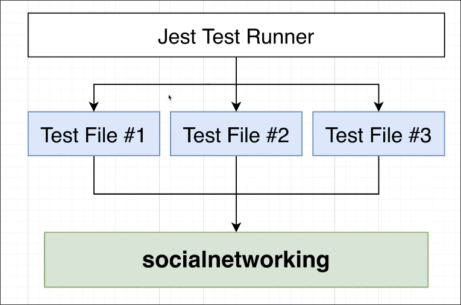

# A Note on Testing

In this section, we will write some tests, but our main focus is to learn about two features of PostgreSQL rather than testing, so the tests will be kept simple.

## Using Jest to run test files in parallel

We will use `Jest` as the test runner because it can run multiple test files simultaneously (usually tests are executed one by one in order), which can speed up the testing process.

## Test interference

However, running multiple tests at the same time may cause interference between different tests, leading to test failures. For example, in test file #1, after testing the creation of a new user and obtaining the latest user, it should be the user just created. But if during the process, test file #3 also creates a new user, then the latest user obtained in test file #1 may not necessarily be the user just created, leading to test failures.

