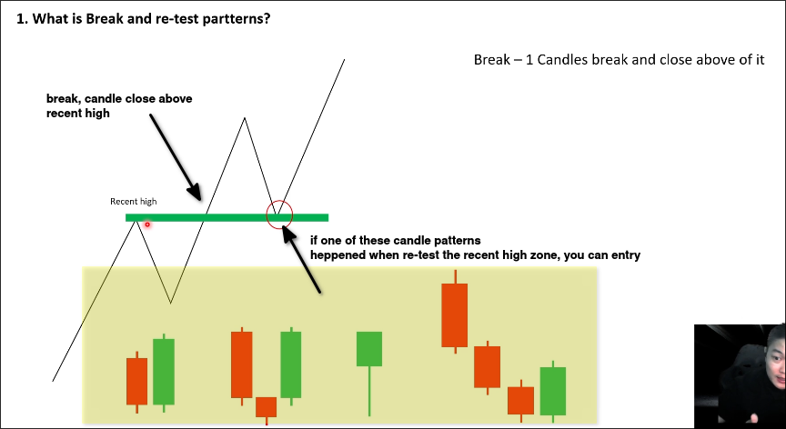
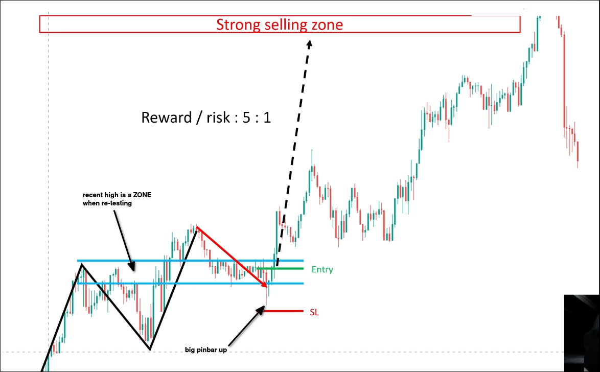
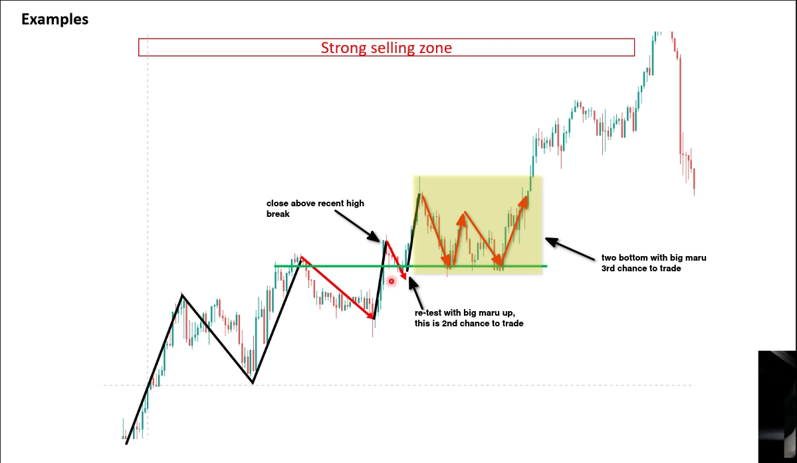

# Break & re-test pattern

When trend is defined, if the recent high is broken and re-tested, we can use *Break & re-test pattern* to enter the market.

Why price re-tests the broken level?
Buyers want to confirm that there is no any seller there, after confirmation, they will push the price up again.

We need to wait for a clearly defined candle pattern to enter the market.

And when the price is re-testing the broken level, it should be a zone.

We can take profit when you see the selling pressure coming into the market or close to the strong resistance zone.

There are many chances to trade in this chart if you know how to use the *Break & re-test pattern*.

## Recommendations

- Only trading when the trend is defined.
- Don't trade when candles signals is not good.
- Be Patient any times.
- Practice this pattern and double pattern every day.

Only double pattern and break & re-test pattern are useful for trading, other patterns are too complex and not perfect.

