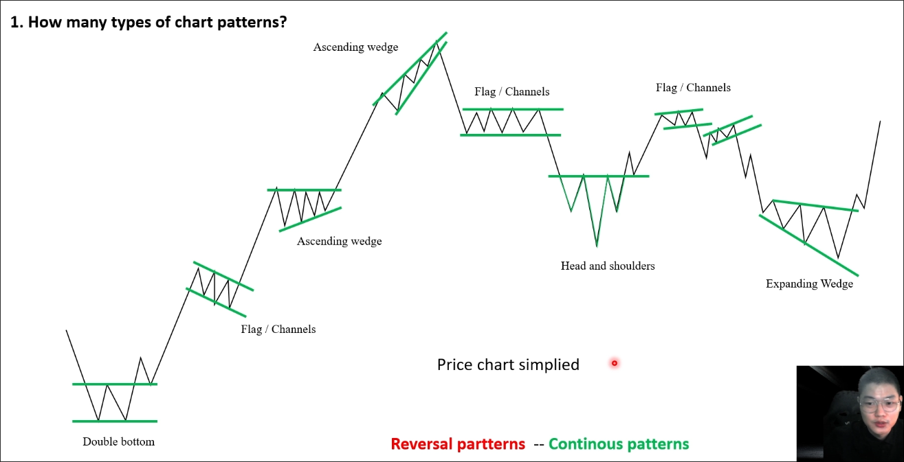
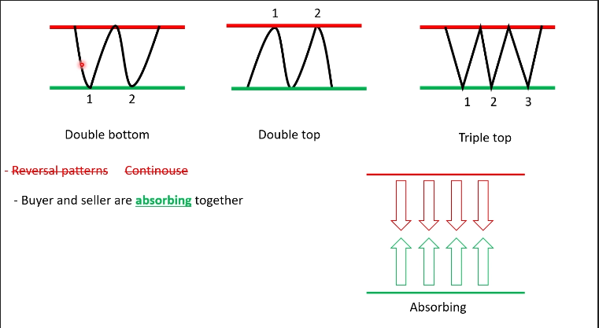
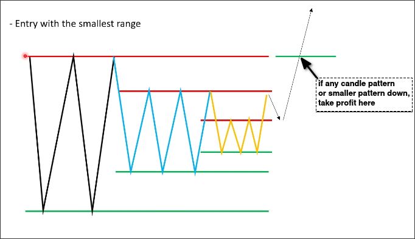
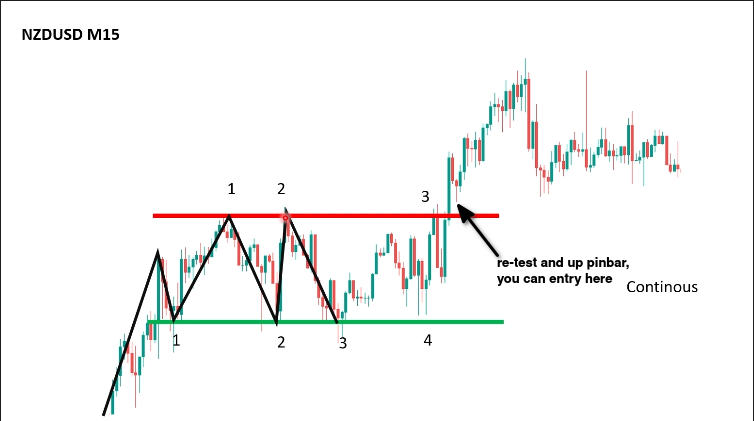
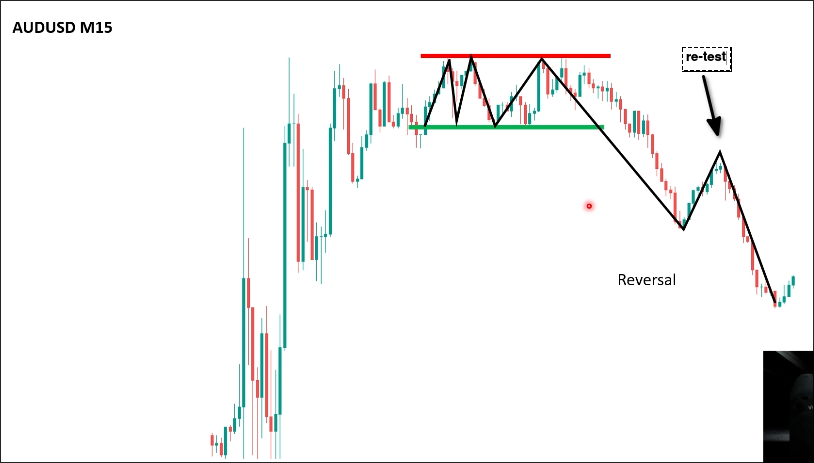

# Double top and bottom pattern

There are many types of price patterns:

There are two types of price patterns:
- Continuation patterns\
- Reversal patterns

But in fact, when you use the price patterns, everything is not clearly, it depends on the market context.

## Double top and bottom pattern

We only use the double top and bottom pattern to trade, other patterns are used to skip the trade.

The meaning of double top and bottom pattern is that there are resistance and support zones in the market, buyers wait for the price to go up to the resistance zone to absorb the selling orders, and sellers wait for the price to go down to the support zone to absorb the buying orders.

> Note the zones are always horizontal.

## Break & Re-test zone

We need to wait for the price to break the resistance or support zone, and then re-test the zone, if you see any candle pattern or smaller pattern appear during the re-test, you can enter the trade.

Why price need to re-test the zone?
Because the price need to confirm that there is no any sellers or buyers in the zone, after the re-test, the price will go up or down again.

Re-test is a very important step, it's common to fake breakout the zone, then the price will go down or up sharply.

## If the range is big

If the distance between the resistance and support zone is big, you can sell the top and buy the bottom, but you need to wait for the price to confirm at least 4 points.

If the range is small, wait breakout and re-test.

## Smaller and Smaller

Sometimes you will the double top and bottom pattern is smaller and smaller like this.

It means the buyers and sellers push the price together and the resistance and support zones are getting closer and closer.

You can enter the trade when the price break the zone and re-test the recent zone but you need to be careful because old zones are also dangerous.

## Find patterns in real charts

The re-test price is not enough close to the zone, you may miss this trade. But missing trade is very normal thing.

## Recommendation

- Don't try to define the price patterns any times.
- Always check the *trend* and the *support* and *resistance* for pattern.
- For me, I just use Trangles to skip to trade.

