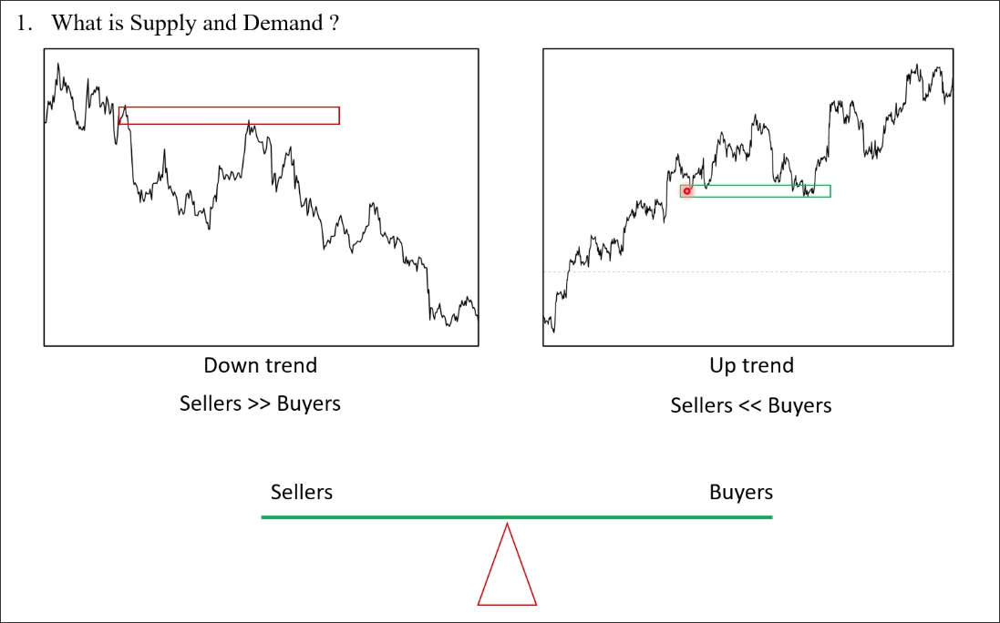
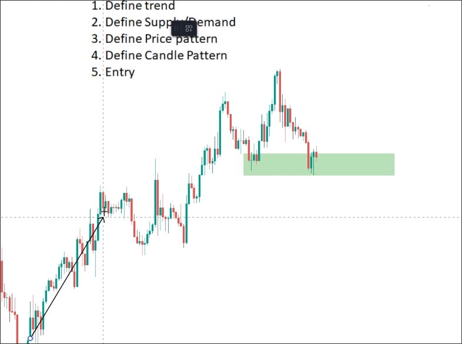
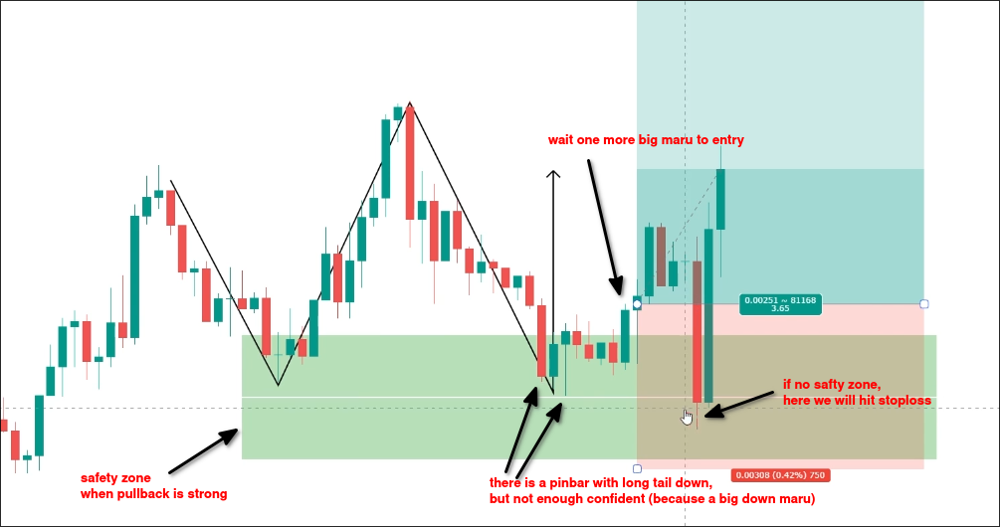
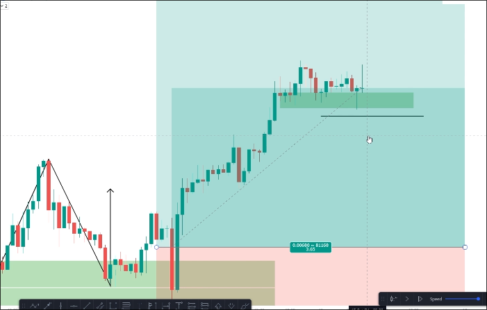

# The Definition and how Supply and Demand zone works

## What is Supply and Demand Zone?

A demand zone is a place where buyers gather to purchase at a cheap price.

A supply zone is a place where sellers gather to sell at a high price.

## There are two types of people in the market

Buyers and sellers.

When the number of people on both sides is similar, the market is flat structure and will produce a zone or range.

When there is a difference in the number of people on both sides, there will be price movement.

## Demand and Supply Zone is the second brick to build a house

First, we need to define the trend.

Second, we need to define the supply and demand zone.

Finally, we wait the price to come back to the zone and then price pattern or candle pattern to enter the trade.

Below are the details after the price reaches the demand zone, we need to carefully observe whether there is a candle pattern or price pattern appearing.

When the wave of pullback to the demand zone is strong, we can use the safety zone to increase the distance of our stop loss in order to avoid sudden false price drops that trigger our stop loss.

Because there is no obvious supply zone above, we use trailing profit.

During the price up process, we can continue to draw out the supply zone and move the stop loss below the zone to profit in a trailing manner.

