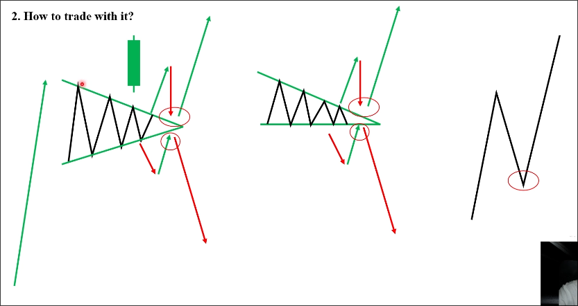

# Triangles: Reference Pattern

As title, this pattern is used only for reference, not for trading.

## What is Triangles?

Buyers and sellers push the resistance and support zones together or apart.

So you can see that resistance and support zones are not horizontal, or one side is not horizontal.

You cannot call it reversal or continuation pattern, it depends on the market.

## How to trade with it?

You must wait for the breakout and re-test.

Beakout must use big maru candle, and re-test must appear one of the candle signals.

Why do we need re-test?

Because buyers don't want to see any sellers when they are pushing the price up.

## Examples

In reality, when the triangle pattern appears, it indicates that the market is very complex. In fact, it is very difficult to define whether a triangle exists, and it often does not retest.

 
 ## Recommendations

 - Don't try to define the price pattern any times.
 - Always check the *trend* and the *support* and *resistance* for pattern.
 - For me, I just use Triangles to skip to trade. (because market is complex)
    - Just some assest can have perfect partterns to entry. (e.g. main pairs)
    - Hard to recognize the Triangles on real trading.
    - Cannot show the best entry and take profit place.
    - *Remove complicated strategy - Only focus on the simple one*

