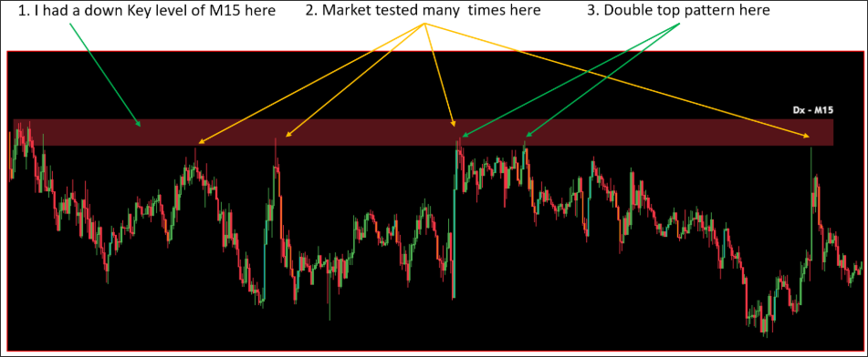

# What is different between A tested time and double pattern?

Because they're all come to ZONE and bounce from zone here

Meanwhile, A tested time will talk power from zone to make it be weaker.

From 2 tested times, we will skip trading with that zone immdediately.
(So, we only trade with the first tested time)

However, A double top/bottom that price also bounces from zone

but it makes a good confirmation for us to ENTRY.

THE KEY FACTOR is LENGTH of WAVE after bouncing from zone.

Please refer to below picture for more detail

So, what is the difference between "Tested many times" & double pattern?

That's the length of wave. FOr a tested time, market will go to test then drop again until recent low.

For a double top pattern, market just bounce from zone by 1-2 candles going down.

You can refer above pic that's much more clearly.

