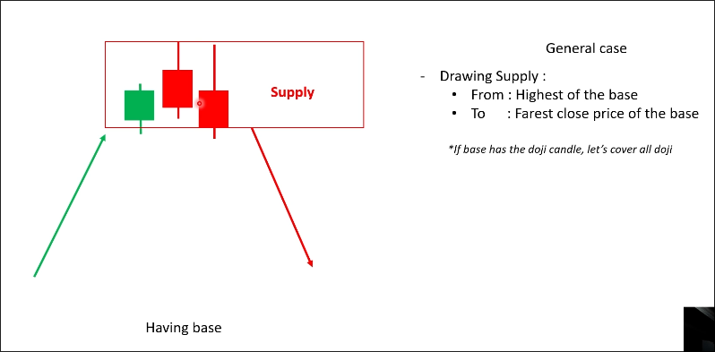
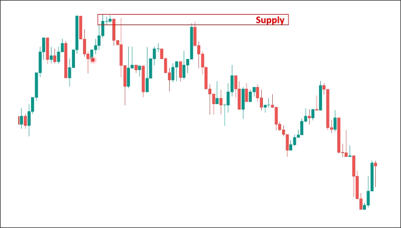
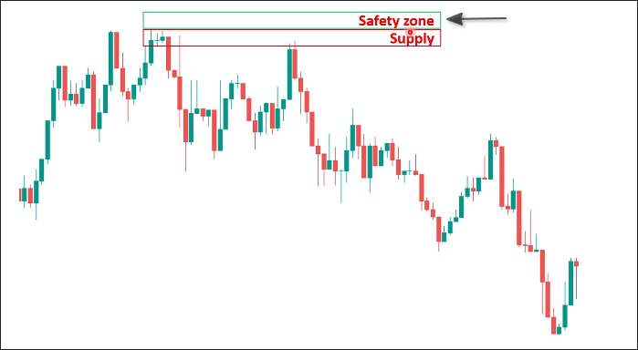
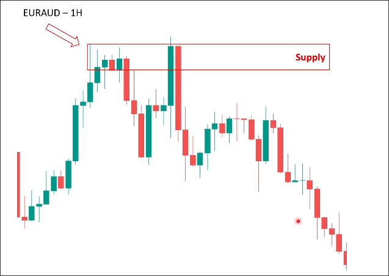
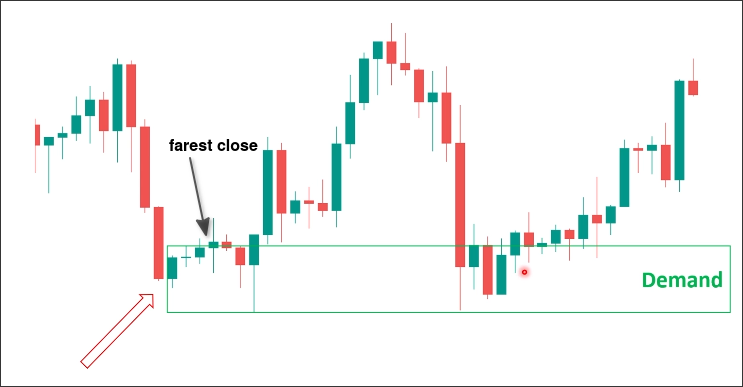

# How to draw SD_Having base

If you see a lot of doji or indecision candles on the same range, then price go up/down sharply, it fits the definition of "having base".

We draw the zone from the highest high of waves to the farest close, but if base has the dojis, zone should cover all dojis.

## Examples

In above example, base has a doji and a indecision candle, so we draw the zone from the highest high of waves to the farest close and need to cover all dojis.

The result zone is too small, so we can draw the safety zone as below:

