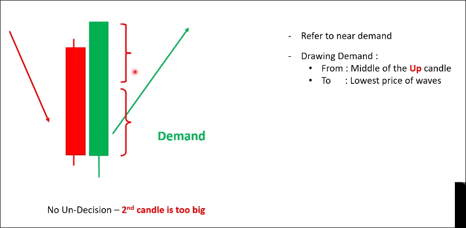
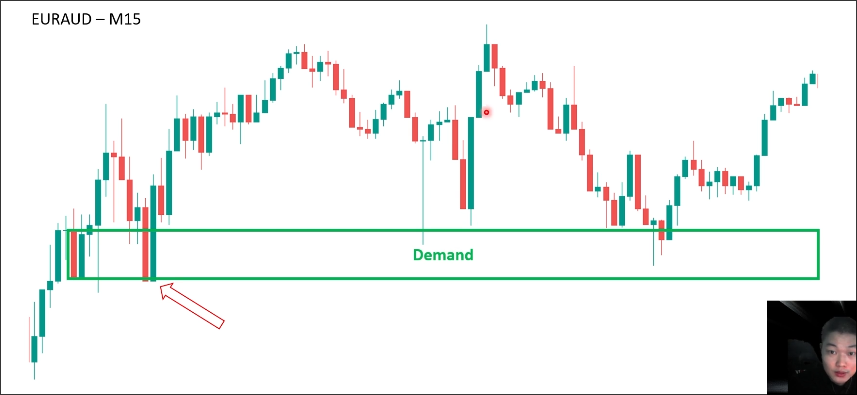
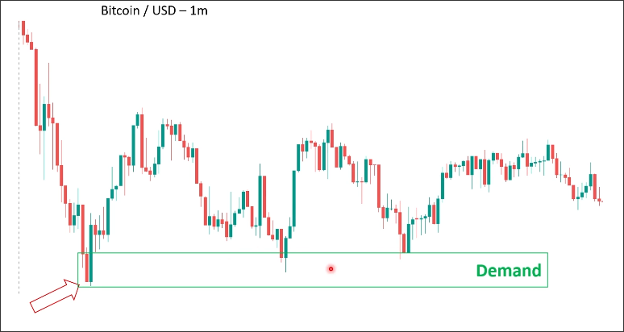
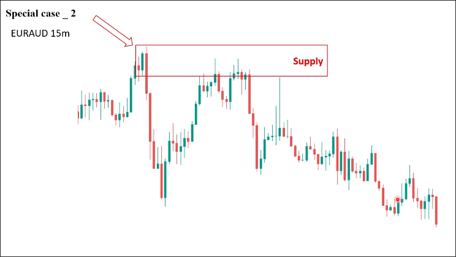

# How to draw SD_No base_2nd candle too big

If the second candle is big maru(?) candle which creater than the first candle a lot, it is no base - special case 2.

When you see this, you can refer to near demand/supply zone.

If there is no near demand/supply zone, you can draw the zone from the middle of the second candle (body?) to the lowest/highest price of waves.

This case is the most powerful among all cases because it represents that there are already many buyers/sellers waiting to trade in this zone.

## Examples

In the example above, the situation of "no base - 2nd candle too big" appears. In the chart, the demand zone generated by the previous pullback (near demand/supply zone) can also be used, or the zone can be directly drawn using the 2nd candle. The results of both methods are similar.

In the situation where "no base - 2nd candle too big" appears in the above chart, we directly use the middle of the 2nd candle and the lowest price of the wave to draw the demand zone because there is no near demand zone.ce of the wave to draw the demand zone.

