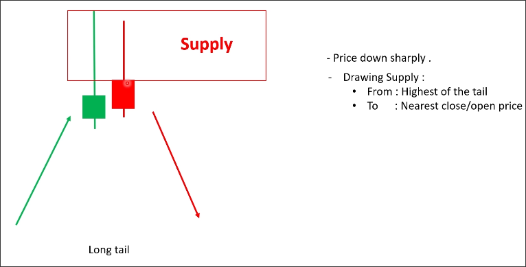
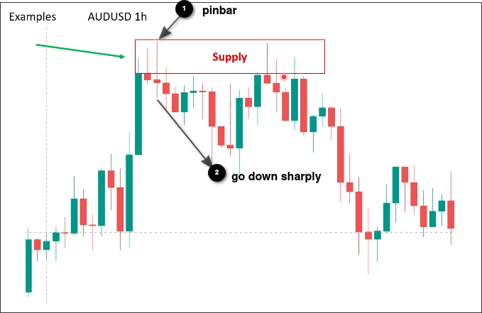
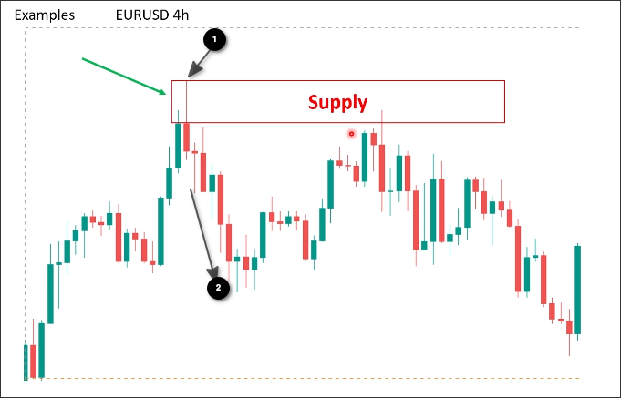
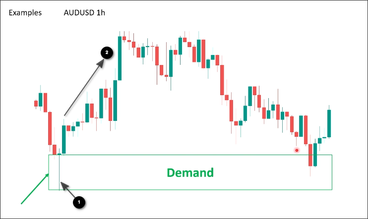
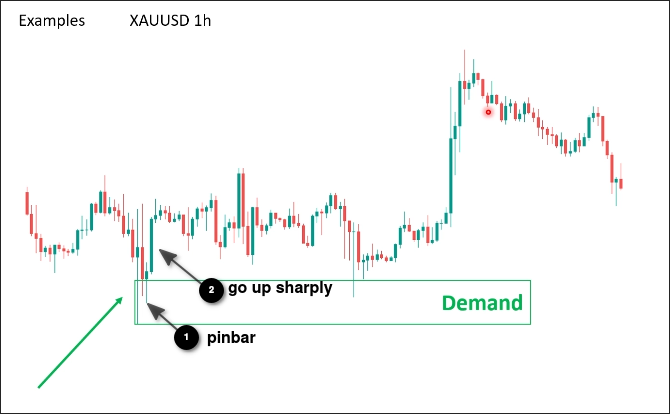

# How to draw SD_No base_Long tail

When the price go up/down sharply after a up/down pinbar, it is a situation that fits the criteria of *no base - long tail*.

In this case, you can draw the zone from highest of the tail to nearest close/open price.

## Examples

