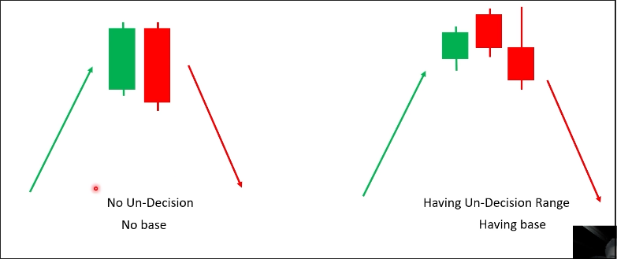
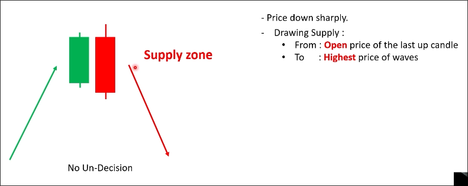
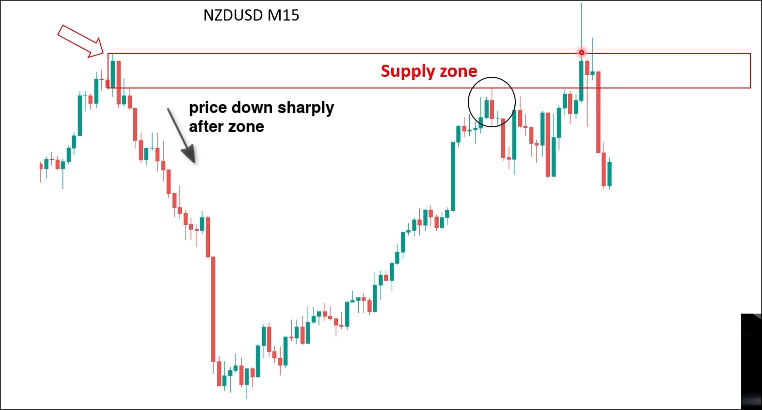
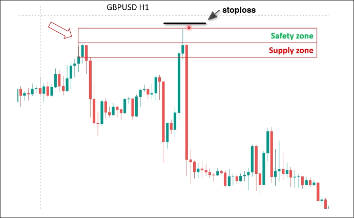

# How to draw Supply and Demand zone?

## Two types of base

**No base**
No indecision range, it means price goes up very strongly and goes down also very strongly. It can show you that the selling pressure at this level is very strong, so that supply zone is very strong.

**Having base**
It means that the market changed slowly from the uptrend to downtrend. You see very small indecision candles or doji candles like this.

In this case, the power of supply zone is not strong like the first one.

## Cases

The two base types above can be further subdivided into the following cases.

- No base
    - General case
    - Special case
        - 1st candle too big
        - 2nd candle too big
        - Tail too long

- Having base - general case

### No base - general case

 The first down candle and last up candle (size?) is quite same together. No big candle in this range. And the price should down quite sharply after the supply zone.

 Draw the supply zone from the open of the last up candle to highest price of waves.

In the above chart, even though there was a long upper shadow breaking through the supply zone during the second retest, the closing price could not stay above the supply zone. This means that this supply zone is very strong.

If the width of the supply zone is very small, you can use a safety zone above to avoid being swept by a long tail stoploss.

