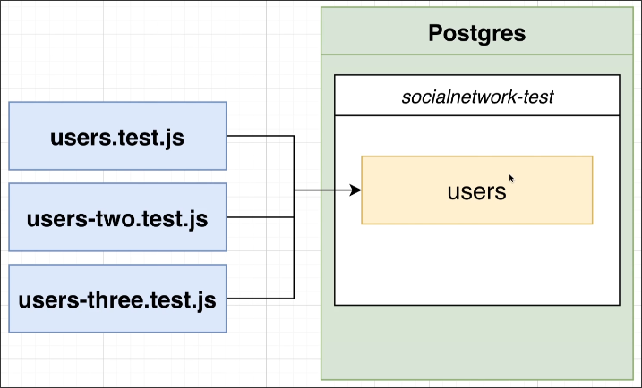
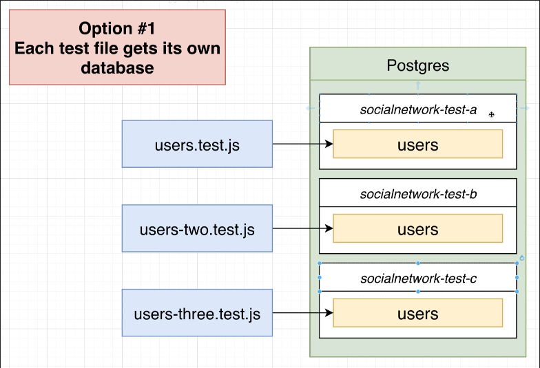
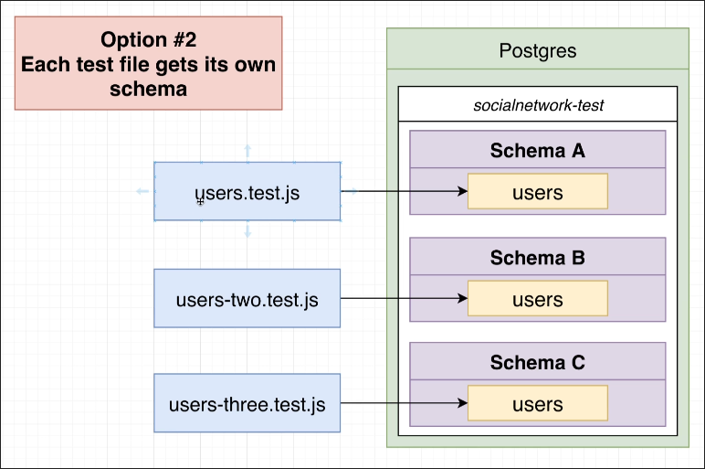

# Isolation with Schema

In [[2025-04-23_Issues-with-Parallel-Tests|Issues with Parallel Tests]], the issue happened because different test files were using the same table.

Just like we create a seperate database for the application in test mode, how about creating databases for each test file?

Although this is feasible, there may be a large number of test files, and you will have to create a database and execute migrations for each test file, which can become very tedious and boring.

Because we are using PostgreSQL, we can create a schema for each test file, so we don't need to create a database for each test file.

Schema can be imagined as a folder in disk, where any object supported by PostgreSQL can be placed, including tables, views, functions, indexes, etc. When we create a database, we actually create a default schema called public.

We'll learn how to create a schema for each test file and how to use it in the following topics.

