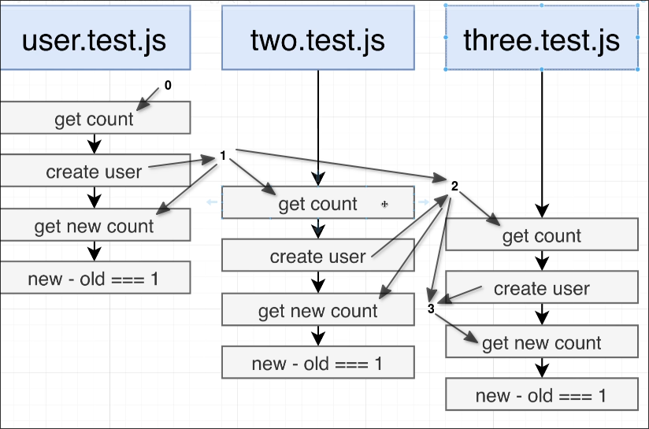

# Issues with Parallel Tests

Let's make other two copies of our test file.

```sh
 tree src
src
├── app.js
├── pool.js
├── repos
│   ├── user-repo.js
│   └── utils
│       └── to-camel-case.js
├── routes
│   └── users.js
└── test
    └── routes
        ├── users.test.js
        ├── users-three.test.js # copy of users.test.js
        └── users-two.test.js # copy of users.test.js
```

Then, we need to modify the test script in `package.json` a bit:

```json
{
  "name": "social-repo",
  "version": "1.0.0",
  "description": "",
  "main": "index.js",
  "scripts": {
    "migrate": "node-pg-migrate",
    "start": "nodemon index.js",
    "test": "jest --no-cache"
               ^^^^^^^^^^ add this
  },
  ...
}
```
In some senarios, Jest may execute the tests sequentially, so we need to add `--no-cache` to make sure that the tests are always executed in parallel.

Now, we try to run the tests:

```sh
$ npm run test

 FAIL  src/test/routes/users-three.test.js
  ● create a user

    expect(received).toEqual(expected) // deep equality

    Expected: 0
    Received: 1

      20 | it('create a user', async () => {
      21 |   const startingCount = await UserRepo.count();
    > 22 |   expect(startingCount).toEqual(0)
         |                         ^
      23 |
      24 |   await request(buildApp())
      25 |     .post('/users')

      at Object.toEqual (src/test/routes/users-three.test.js:22:25)

 FAIL  src/test/routes/users.test.js
  ● create a user

    expect(received).toEqual(expected) // deep equality

    Expected: 0
    Received: 1

      20 | it('create a user', async () => {
      21 |   const startingCount = await UserRepo.count();
    > 22 |   expect(startingCount).toEqual(0)
         |                         ^
      23 |
      24 |   await request(buildApp())
      25 |     .post('/users')

      at Object.toEqual (src/test/routes/users.test.js:22:25)

 FAIL  src/test/routes/users-two.test.js
  ● create a user

    expect(received).toEqual(expected) // deep equality

    Expected: 0
    Received: 1

      20 | it('create a user', async () => {
      21 |   const startingCount = await UserRepo.count();
    > 22 |   expect(startingCount).toEqual(0)
         |                         ^
      23 |
      24 |   await request(buildApp())
      25 |     .post('/users')

      at Object.toEqual (src/test/routes/users-two.test.js:22:25)

Test Suites: 3 failed, 3 total
Tests:       3 failed, 3 total
Snapshots:   0 total
Time:        0.417 s
Ran all test suites.
```
You will find that the test results become unpredictable, sometimes two tests fail and sometimes three, the reasons are as follows.



As shown in the figure above, different test files will be executed simultaneously and will interfere with each other's results. If the `create user` in between `get count` and `get new count` is also executed in other files, the result of this test will fail.


