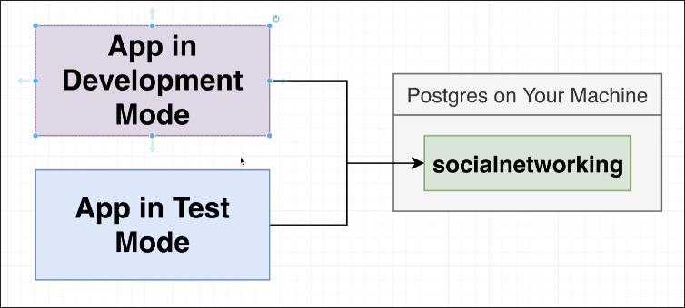
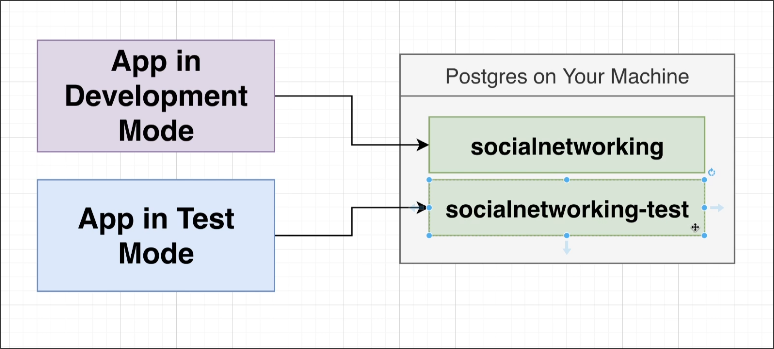

# Multi DB Setup

In [[2025-04-21_Disconnectin-After-Tests|Disconnectin After Tests]], the test is still failing because both the application in development mode and the application in test mode are using the same database.


We need to set up a separate database for the test mode.

```sh
$ psql -U postgres
postgres=# CREATE DATABASE socialnetwork_test;
```
Then, we can switch the database in the `beforeAll` method of the test file to use the test database.

```js
// src/test/routes/users.test.js

// ...

beforeAll(() => {
  return pool.connect({
    host: 'localhost',
    port: 5432,
    database: 'socialnetwork_test', // switch to test database
    user: 'postgres',
    password: ''
  });
});

// ...

```



Now, let's run the test again.

```sh
$ npm run test

> social-repo@1.0.0 test
> jest

 FAIL  src/test/routes/users.test.js
  ✕ create a user (1 ms)

  ● create a user

    error: relation "users" does not exist

      46 |
      47 |   static async count() {
    > 48 |     const { rows } = await pool.query(
         |                      ^
      49 |       'SELECT COUNT(*) FROM users;'
      50 |     )
      51 |

      at node_modules/pg-pool/index.js:45:11
      at Function.count (src/repos/user-repo.js:48:22)
      at Object.<anonymous> (src/test/routes/users.test.js:23:25)

Test Suites: 1 failed, 1 total
Tests:       1 failed, 1 total
Snapshots:   0 total
Time:        0.299 s
Ran all test suites.
```

Still failing because the test database is empty, there is no any structure inside the test database yet. We need to execute all the migrations somehow to set up the test database before running the test.

We'll do this in the next topic.


