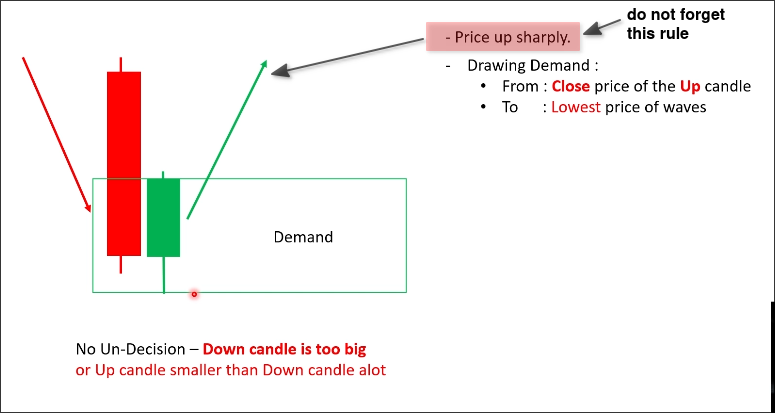
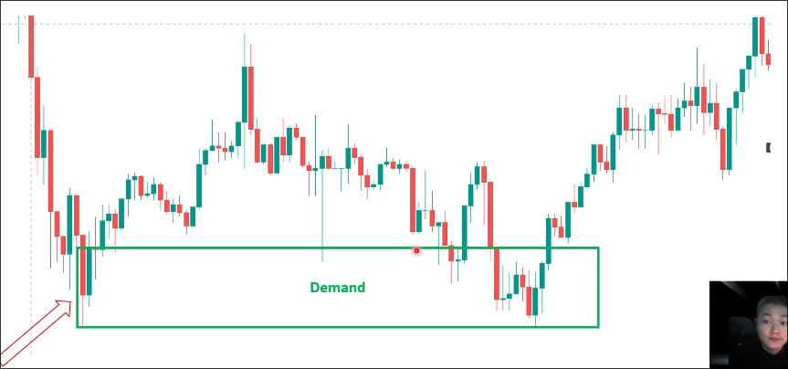
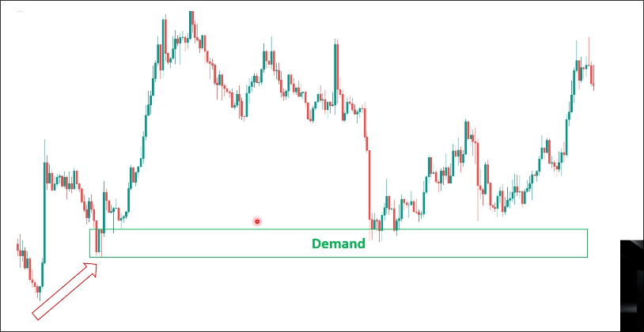
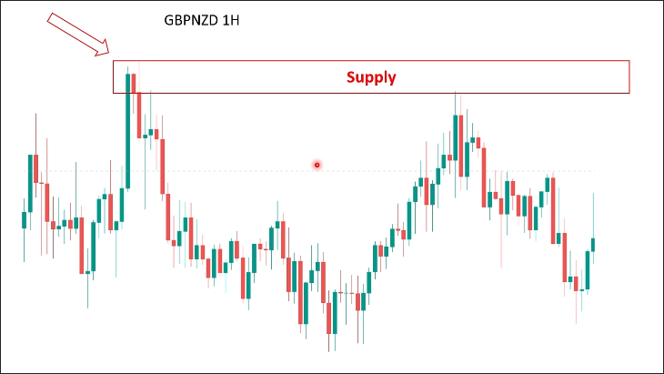

# No base: the 1st candle is too big

(assume the trend is up)
When the last down candle is too big, we need to draw the zone from the open of the first up  cnadle to the lowest low of the wave. And remember after the first up candle, the price should go up sharply.

## Examples

