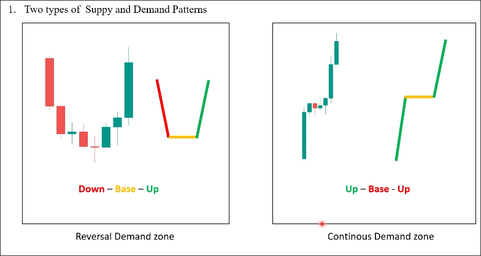
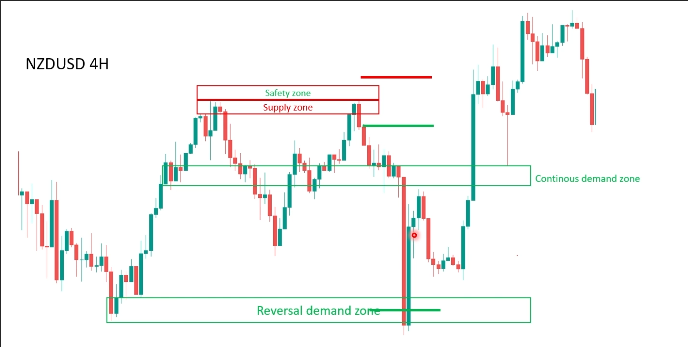
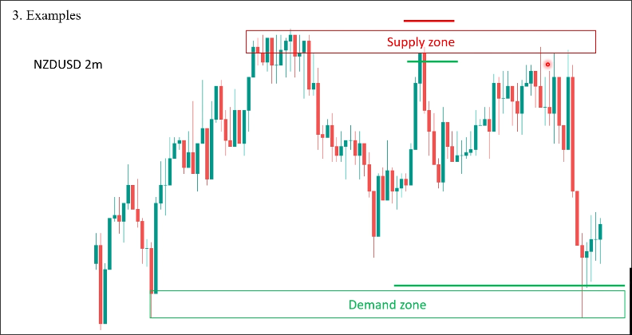

# Two types of supply and demand patterns

## Reversal zone and continuation zone

### Reversal zone

Reversal zone shows buyers entering the market and both sides reaching a balance of power, after which the power of buyers exceeds that of sellers causing a price reversal, indicating the strength of buyers.

### Continuation zone

Continuation zone is a short range or a very small pullback, it may be buyers taking profits because the price has risen too high, it also represents an indecision zone, unable to show buyers' power like a reversal zone.

> We mainly use the reversal zone combined with price action for trading, and we do not use the continuation zone for trading because the reversal zone can show the strength of the buyers, while the continuation zone only shows indecision.

## Example of zone

You can see in the above image that we use reversal zones to plan entry, stop loss, and take profit. Although there are also some continuation zones, we do not use them for any trading plans.

We can double the supply zone to create a safety zone to increase the distance of the stop loss to avoid being swept out, but the risk-reward ratio still needs to be greater than 2.5 before entering a trade.

Above is a 4-hour chart, in smaller timeframes, demand zones and supply zones can also work very well. Below is an example of a 2-minute chart.

Even if you miss the opportunity in the first retest zone, there are several more opportunities to enter later.

## Some doubt

1. How should the thickness of the zone be defined? In the first example, the author says that the thickness of the supply zone is very small, so a safety zone is used. This should indicate that there is a defined method for determining the thickness of the supply zone.

2. The second example explains that even if the first entry opportunity is missed, there are still many opportunities to enter later. This contradicts the idea that trading only occurs on the first retest because the retest zone will consume the power of the zone.

