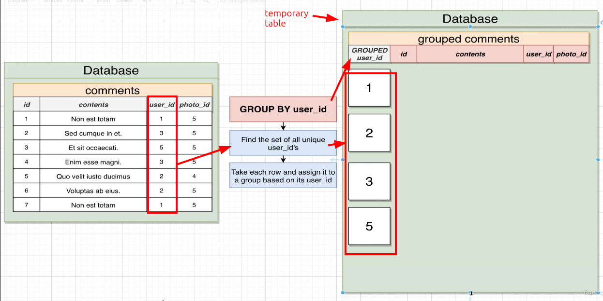
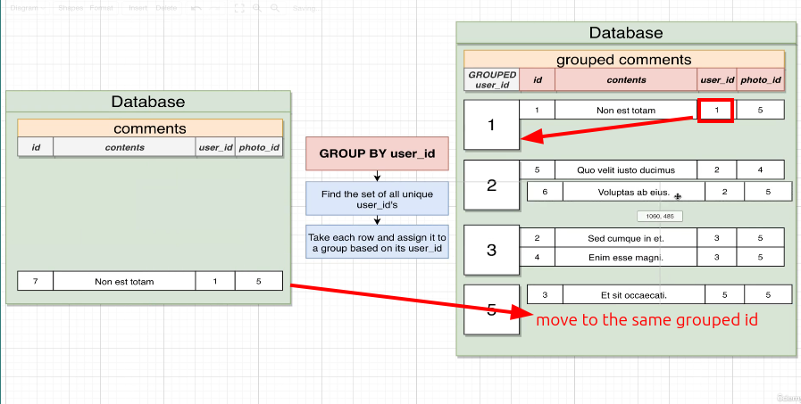

# Visualizing GROUP BY process

```sql
SELECT user_id
FROM comments
GROUP BY user_id;  -- grouping rows by user_id
                   -- we call `user_id` the grouping column
                   -- which is the only column we can select from the grouped table
                   -- it means we cannot select any original column except the grouping column
```

Besides the grouping column, we can also select [[2025-01-02_Aggregation-on-Group|aggregation functions]] in the grouped table.

GROUP BY has two steps:
1. Find the set of all unique values in the grouping column
2. For each unique value, find all rows that have that value in the grouping column

Below is a visual representation of the GROUP BY process:







