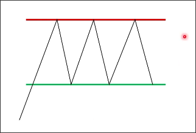
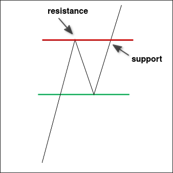
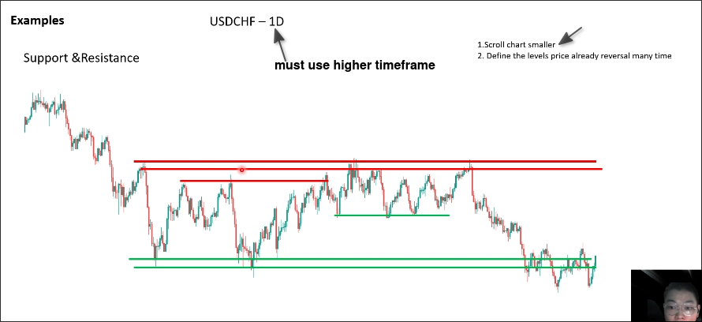
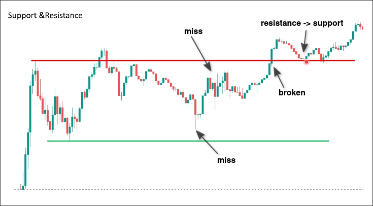
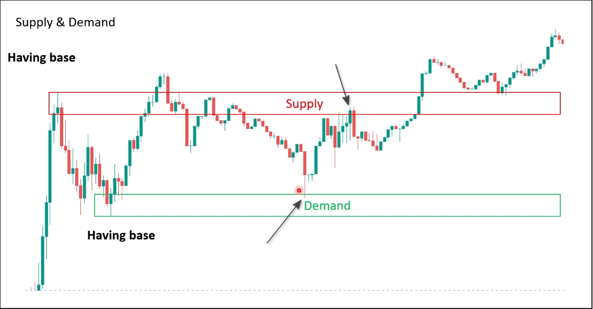

# Compare Supply and Demand with Support and resistance

## What is it?

**Support**: The levels have many buyers focused on buying at that level.
**Resistance**: The levels have many sellers focused on selling at that level.

## How to judge?

Shrink the chart in the higher timeframe, and look for the levels where the price reverses many times. These levels are the support and resistance levels.

## When support and resistance are broken

- Support was broken -> Resistance
- Resistance was broken -> Support

> So when drawing support and resistance, look for the levels with the most reversals, which can be a combination of reversals in different directions.

## Examples

The above image is an example, where you can see that we use a higher 1D timeframe, and then scroll the chart smaller to find levels where reversal occurs many times.

> In a small timeframe, support and resistance are not accurate due to large fluctuations.

It can be seen that using support and resistance makes it easy for prices to be broken through or for prices to fail to reach a retracement.

Using the same image, let's analyze it using demand and supply.

It can be seen that if using supply and demand, the price of backtesting will easily reach the zone and not miss trading opportunities.

## Compare Supply and Demand with Support and Resistance

|         | Support & Resistance | Supply and Demand
|---------|----------------------|------------------|
| Definition | Price levels | Price range |
| Drawing | Exactly | Having deviation for each movement |
| Signal | Cannot show the best place to Entry/Limit/Stop/TP/SL... | Can show the best place to Entry/Limit/Stop/TP/SL... |
| Miss chance possiblity | Normally | Less than Support & Resistance |
| Timeframe | Big timeframes | All timeframes |

