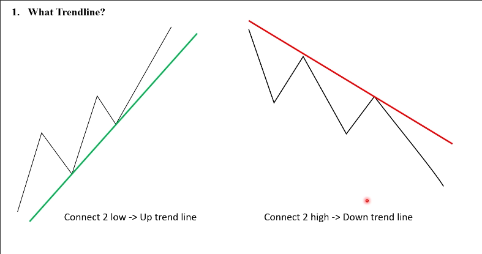
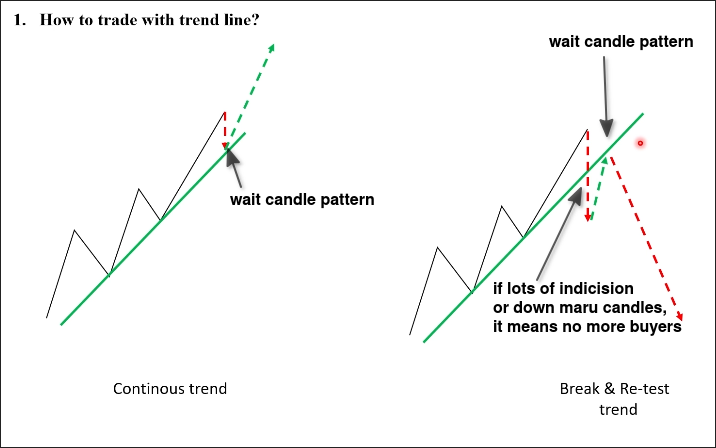
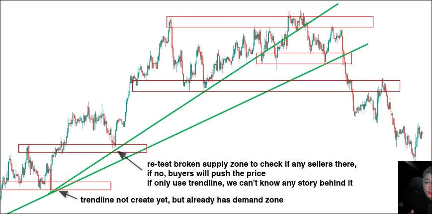
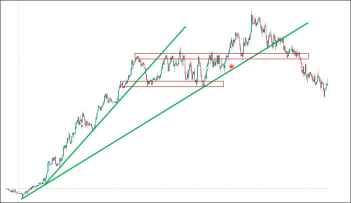

# Compare Supply and Demand with Trendline

## What is trendline?

Connect two highs or two lows to create a trendline.

## How to trade with trendline?

We have the above two methods to use trendlines for trading.
- Continous trend
- Break & Re-test trend

## Compare to supply and demand

The above diagram shows that there are many trendlines that can lead to complex analysis, and demand and supply zones are formed earlier than trendlines. Some positions can only be understood through demand and supply zones to know the story behind them.

The initial part of the chart is difficult to determine high and low points, which is also one of the drawbacks of trendlines. In the part between the two trendlines, trading can only be done using supply and demand.

## Conclusion

So, trendline has no any meaning for trading, we only use demand and supply zones to trade.
