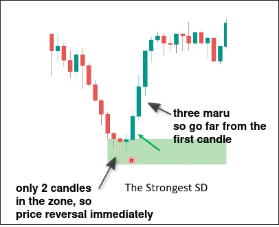
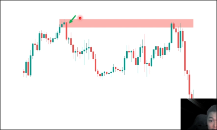
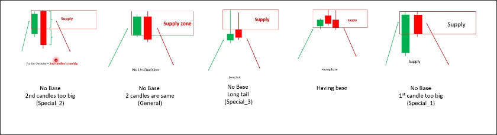
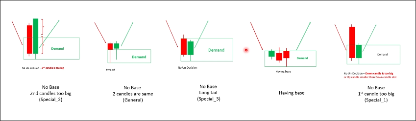
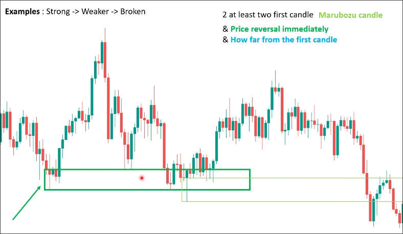
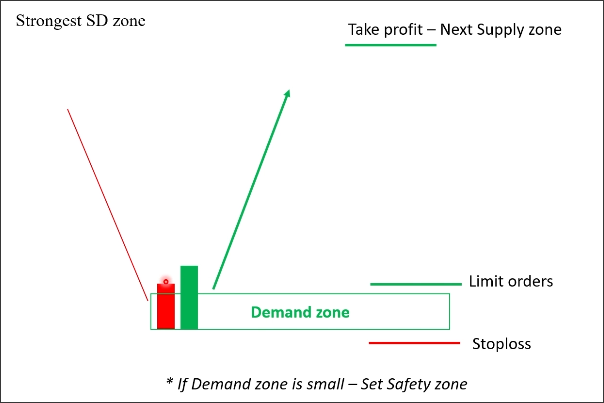
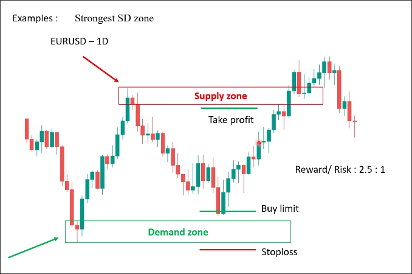
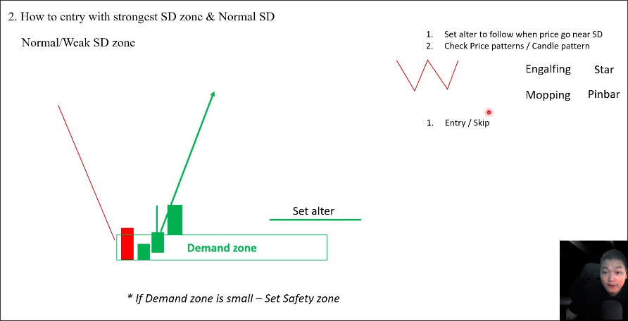
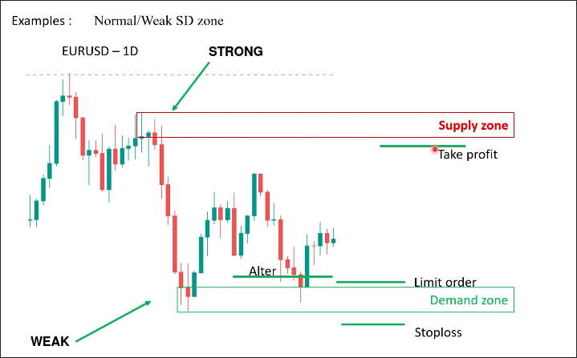

# Define strongest Supply Demand zone: Order block

## How to define STRONG SD zone

SD zone is imbalance between buyers and sellers. We have three factors to define the obvious imbalance range:

1. at least 2 first candles after the reversal place is the marubozu candle.

2. price reversal immediately, which show you that a lot of buyers/sellers want to join into the market.

3. How far price can go from the first candle?

 
The price reversed immediately in the above chart. Although there is only one maru candle, it is very large. The price has moved far since then, so it belongs to a STRONG supply zone.

## reversal cases, from strong to weak

The types of reversal cases will also affect the strength of the SD zone.

The following image shows a sequence of reverse cases from strong to weak from left to right.

## More examples

The picture above shows two demand zones, the one on the left is strong and the one on the right is weak.

I found that even though the first strong condition clearly states that at least two of the first candles are maru candles, in fact, many only have one large maru candle, which the instructor also defines as a strong zone.

The second demand zone has multiple candles at the base, causing the trend to change from downtrend to uptrend in a slow process. There is only one maru candle and the price has not moved very far, so it is a very weak demand zone.

## Trade with STRONG SD zone

If it is a strong zone, we can directly set limit orders, stoploss and take profit above and below the zone.

Below is the example:

Note that the recent high will also be a supply zone, because sellers want to sell at high prices. Therefore, our take profit should be set below this supply zone, as there will be many sellers trading based on this supply zone. If the take profit is set above the supply zone, waiting sellers may push the price down and trigger a stop loss.

## Trade with normal/weak SD zone

Normal and weak SD zone indicates that there is no more buying or selling interest, so when the price returns to this area, we need to wait for a price pattern (double pattern) or candle pattern (Engulfing, star, mopping, pinbar) to confirm that there are buyers/sellers entering the market before we can trade.
There is a supply zone and a demand zone in the above image.

The diagram shows a supply zone and a demand zone. The first supply zone is STRONG because there are three consecutive large maru candles and the price has moved far.

However, even though the trend changed immediately in the demand zone, there was only one maru candle and the price did not move very far, so it is a weak demand zone.

We waited for the price to return to this area and then an engulfing pattern appeared, confirming that buyers had entered the market. We then placed limit orders and stop losses in the demand zone, as it is a weak zone and the price may retest many times. We don't need to worry too much about the limit order not being triggered.

