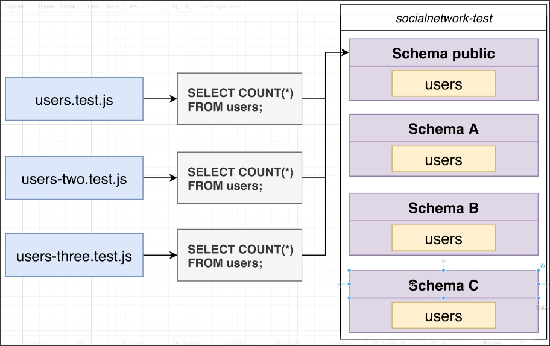

# Routing Schema Access

Even though we have created many schemas, each test file accesses the database through the user repository, and the SQL used in the user repository does not designate a schema. Therefore, these test files access the database using the default schema.


```javascript
// src/test/routes/users.test.js

// ...

it('create a user', async () => {
  const startingCount = await UserRepo.count();
  //                          ^^^^^^^^^^^^^^^^ using the user repository to access the database

  await request(buildApp())
    .post('/users')
    .send({ username: 'testuser', bio: 'test bio' })
    .expect(200)

  const finishCount = await UserRepo.count();
  //                        ^^^^^^^^^^^^^^^^ using the user repository to access the database
  expect(finishCount - startingCount).toEqual(1)
})
```
```javascript
// src/repos/user-repo.js

// ...

class UserRepo {

  // ...

  static async count() {
    const { rows } = await pool.query(
      'SELECT COUNT(*) FROM users;'  // This SQL does not specify a schema
    )

    return parseInt(rows[0].count)
  }
}

module.exports = UserRepo;
```




Some people may consider to allow .count() to accept a specified schema name as a parameter and adding it to the SQL query. This way, test files can specify the schema name. However, this would require specifying the schema name in every test, which would become very cumbersome.

There is a better way to do this. We will introduce it in the next topic.


