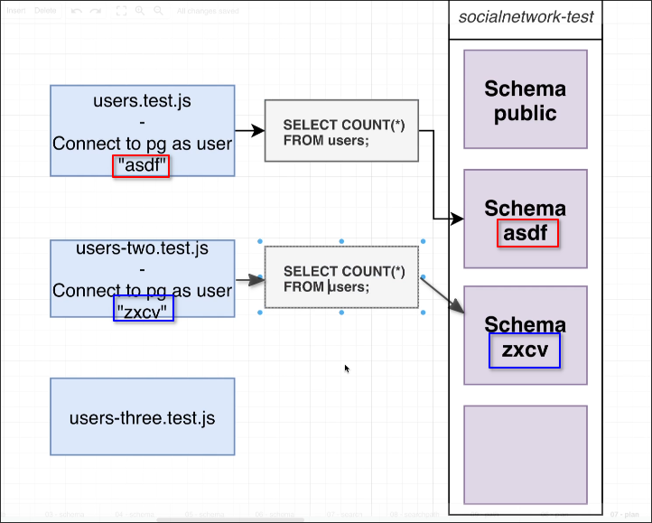

# Strategy for Isolation

To solve the issue of [[2025-04-24_Routing-Schema-Access|Routing Schema Access]], the better way is to isolate by connecting to the database with different users, and also create different schemas with users' name, below are the steps to achieve this:

For each test file...

1. Connet to PG as normal

2. Generate a random string of characters, such as "asdf"

3. Create a new user (role) with that name

4. Create a new schema with that name

5. Tell our test file to connect to the DB with that name

As shown in the diagram, even if we use the same SQL queries and do not specify a schema, PostgreSQL will automatically direct these SQL queries to different schemas because we are connecting to the database with different users, and there are schemas with these user names. This achieves the effect of isolation.

