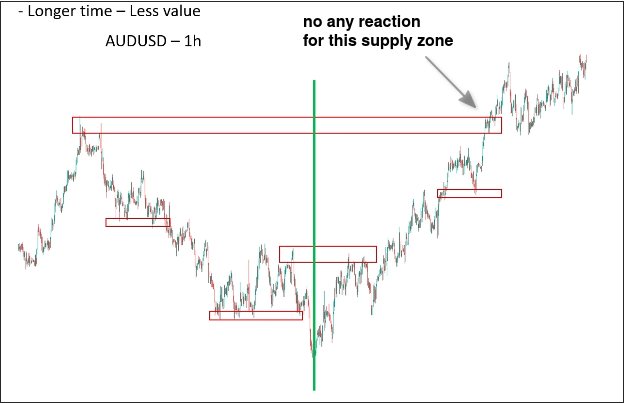
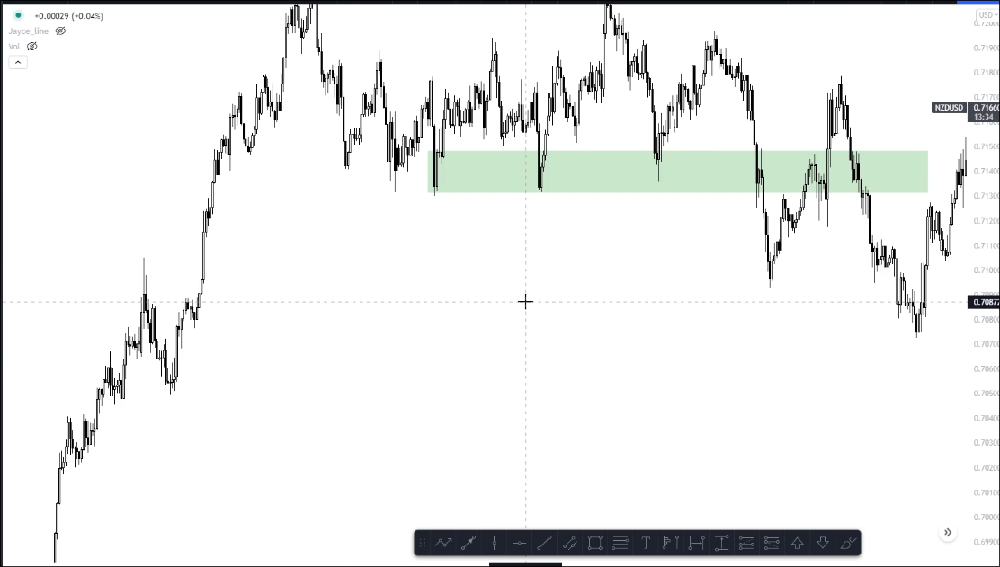
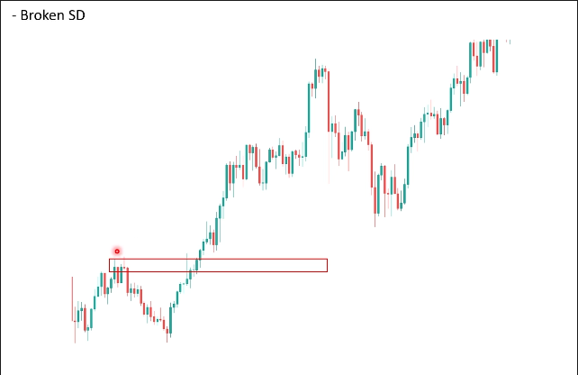
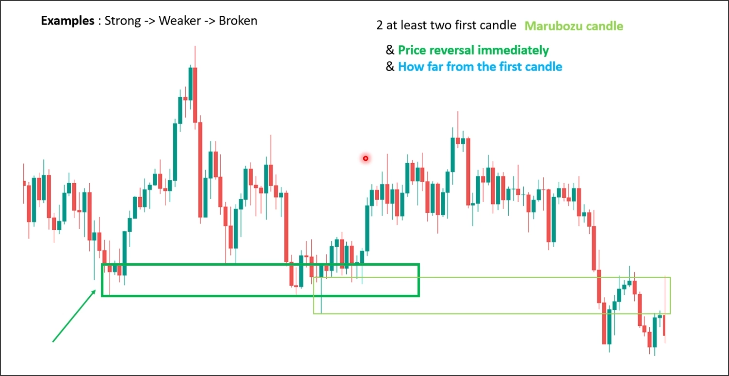

# Define obsolete SD zone

There are three types of obsolete SD zones:

## Longer time

If the duration of the SD zone is too long, its power will decrease.

Using TradingView's chart, press Alt + R, and then scroll to shrink the chart until the candle is quite small as follows.

We just need to define and use the SD zone within this range, the previous SD zone is no longer needed.

## Broken SD

We also won't care about the SD areas that have already been broken because they are no longer effective.

## No price action in normal and weak cases

In the case where the SD zone is composed of *normal and weak cases*, when price retraces to that zone, there must be *price action (double top, double bottom, engulfing, pin bar, etc.)* in order to trade. If there is no price action, we also define this SD zone as an obsolete SD zone.

