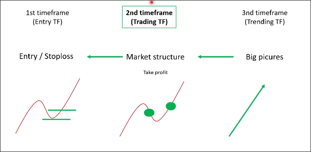

# Definition and select timeframe

## Why you need to use it?

- Maximum profit
- Minimum the looses
> Higherst RR

- Understand the whole pictures
    - Avoid the non-trading range / select the best range to trade
    - Highest winrate

So the multiple timeframe can give us:
- Exactly entry position
- Smallest stoploss
- Biggest take profit
- Avoid fluctuation market

## Combine more timeframe together

Using a combination of three timeframes is the best.

There are three timeframes:

- Trending TF: big pictures
To see the trend and the market is noisy, fluctuating or not.

- Trading TF: market sructure
To see the market structure, which means to analyze the pull wave and pullback wave.

- Entry TF: entry / stoploss
Using small timeframe to find the entry position and stoploss to minimize the risk.

## How to find your trading timeframe?

It depends on your trading style:

- Scalping: 1m, 2m, 5m
- Swing: 15m, 1h, 4h
- Investing: daily, weekly, monthly

You need to understand yourself:

- Your personality:
    - hot-tempered
    - patient
    - optimistic

    If you are a hot-tempered person, do not do scalping, because when you lose, you will revenge trade and lose more money.

- Your strategy:
    - Good
    - Excellent
    - Expert

    Scalping need a expert strategy. After the course, you may have a excellent strategy, but you still need to practice it for about 3-6 months to become a expert.

- Your time:
    - Full-time
    - Part-time

    If you are a full-time trader, you can do scalping, if not, you can do swing trading or investing.

## Best multiple timeframe combination

For new traders, the best combination is:
M15-H1-H4

But in level 0 course, it says that the best combination is:
M5-M15-H1
