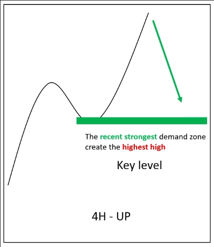
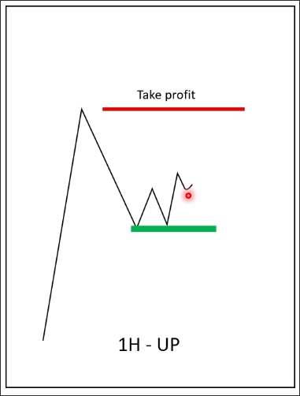
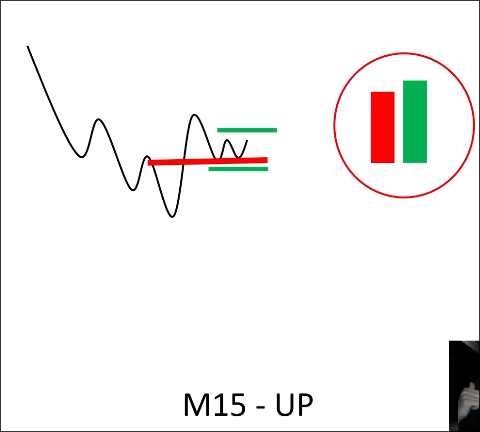

# Entry with confluence strategy

## Strategy

We must sequentially check if the conditions are met from trend TF -> trading TF -> entry TF.

### Trend TF

1. The structure is higher high and higher low to confirm the uptrend.
2. The recent strongest demand zone (KL) created the highest high and price still above this KL.

### Trading TF

1. Price comes into the demand zone (KL) on the trend TF.
2. Price already created same structure as higher high and higher low (uptrend).
3. You can define the first place to take profit at the recent high of the market.

### Entry / stoploss TF

1. Price already changed from down movement to the uptrend by breaking the last support (red line).
2. Price already comes and retests the last support (red line) to confirm the uptrend with the structure same as double bottom.
3. At the end of double bottom, you can see we have a engulfing pattern at the time.
    - you can entry above of engulfing pattern.
    - you can set stoploss below the engulfing pattern.

## Benefits of Confluence Strategy

Because the trends of the three timeframes are all in the same direction, we can even find a suitable take profit price from the trend timeframe instead of the trading timeframe.
