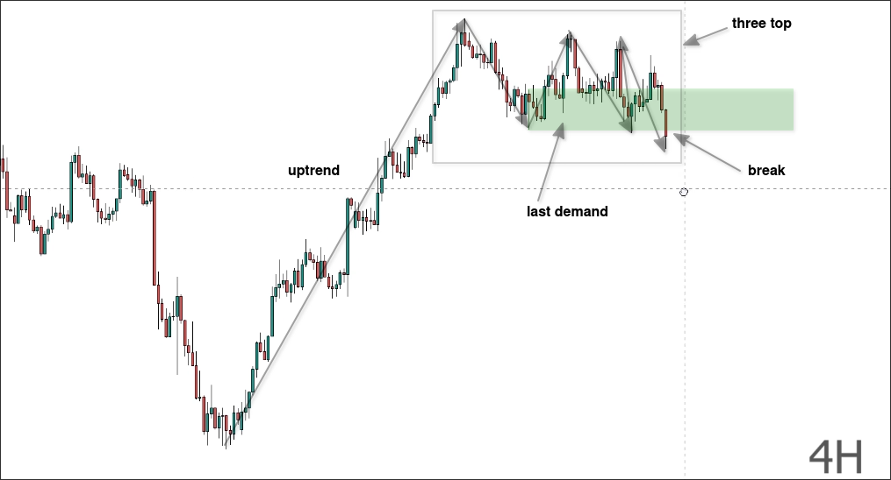
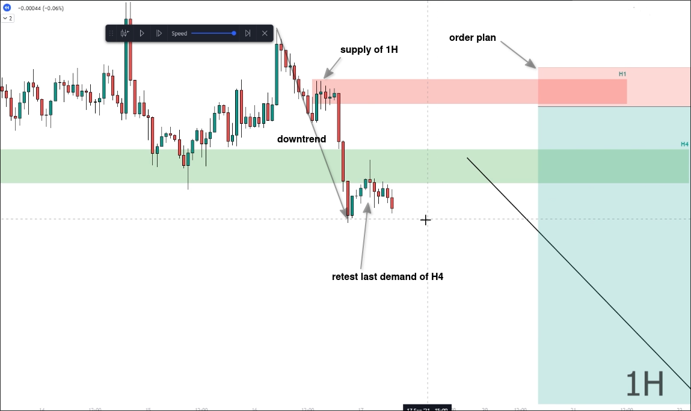
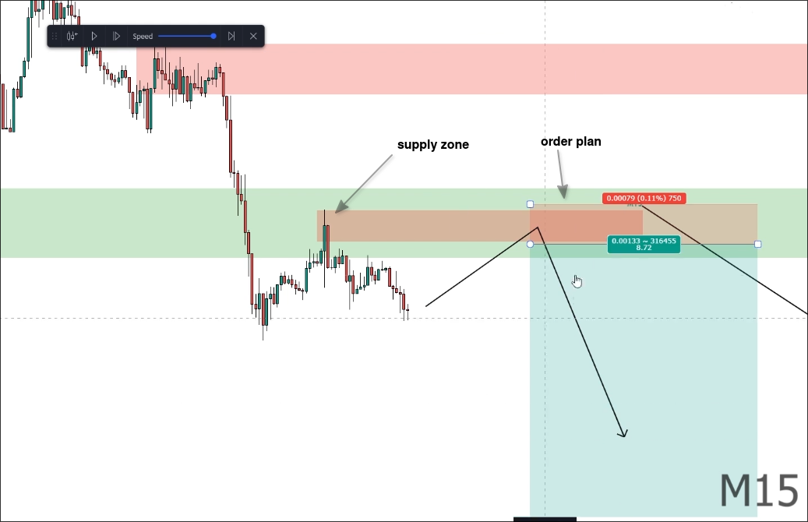
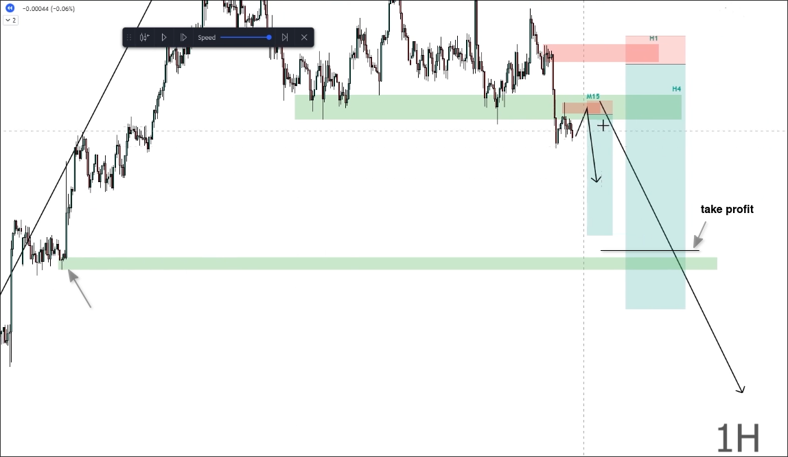

# Multiple time frame exmaples

## Trend Timeframe analysis

In the above chart, we can see that there was originally an uptrend, but it appears that three tops have formed and then broken through the latest demand zone. This may be the beginning of a downtrend.

## Trading Timeframe analysis

Then we can switch to trading timeframe to see the market structure and find a good entry point.

In the above chart, we can see a clear downtrend with a supply zone, and we can use it to plan our entry.

However, after breaking through the H4 demand zone, it seems to have started to retest that zone. In this case, there is a possibility of a direct decline after the retest without reaching the supply zone above.

## Entry / Stoploss Timeframe analysis

We can switch to a entry/stoploss timeframe to find a good entry point at retest.

In the above chart, we can use entry / stoploss timeframe to find a good entry point at retest. So now we have two order plans. We just need to wait for confirmation to appear in any area of the plans, then hang the entry and stoploss order.

## Where to take profit?

We can switch back to the trading timeframe and use the previous uptrend's demand zone as the target for take profit.

