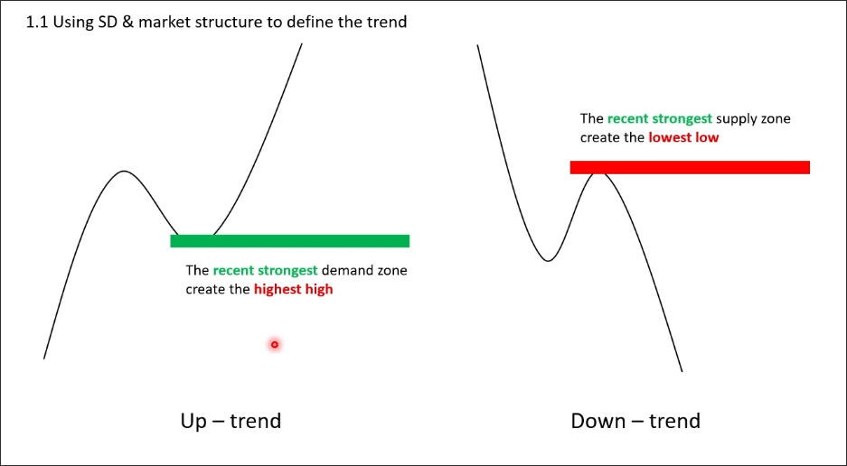
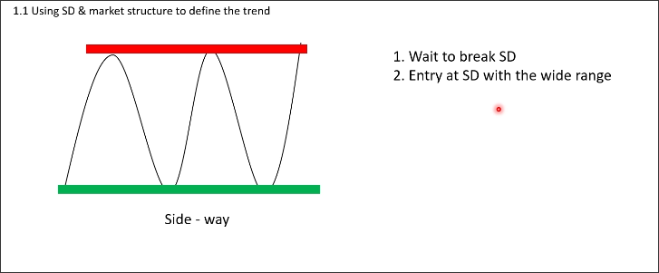
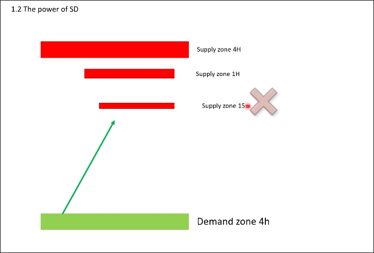
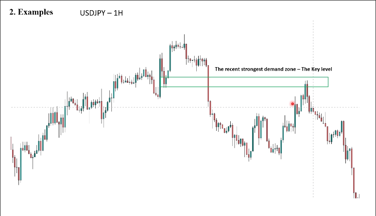
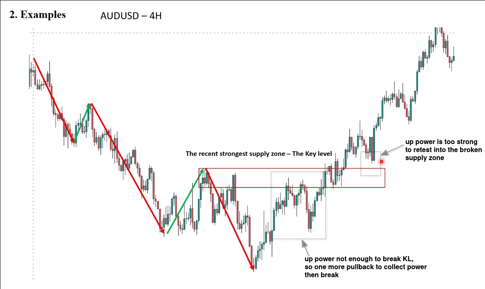

# Understand the big pictures

## How to understand the big pictures

### uptrend & downtrend

We identify the recent strongest demand/supply zone, if they are broken, it indicates that the trend has changed to another direction.

The recent strongest zone is referred to as the key level.

### sideways

When demand and supply zones repeatedly appear in the same location, it indicates a sideways trend.

You can wait for the demand or supply zone to be broken and then trade when it is retested.

Or if the distance between the demand and supply zones is large enough, you can buy in the demand zone and sell in the supply zone.

## Power of SD

You must know from which timeframe's SD zone the pullback or pulse wave is initiated, because we need to predict where the pulse wave or pullback will reach near which price.

We will mostly use the SD zone of a lower timeframe to predict the target price of a pullback or pulse wave. For example, if my pullback starts from the 4-hour timeframe, the SD zone of the 15-minute timeframe cannot be used to predict the target price of the pullback, but the SD zone of the 1-hour timeframe can be used to predict the target price of the pullback.

## Examples

The chart shows that the uptrend of KL has been broken, and the trend has changed from uptrend to downtrend. The price subsequently retraced to the broken demand zone and fell.

The following image shows a more complex situation of changing trends.

At the beginning, the power was not enough to break through the supply zone, so another pullback was made to gather more power before successfully breaking through the supply zone, causing the trend to change from a downtrend to an uptrend.

After breaking through the strong resistance, the pullback was unable to retest the broken supply zone, causing the price to rise directly.

