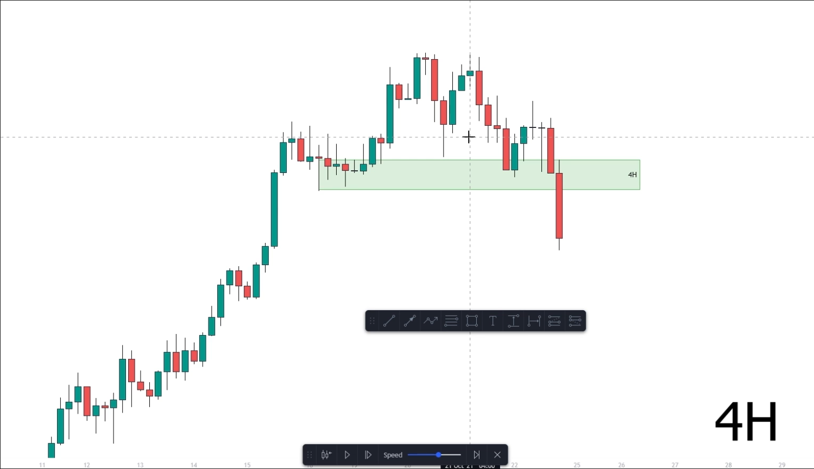
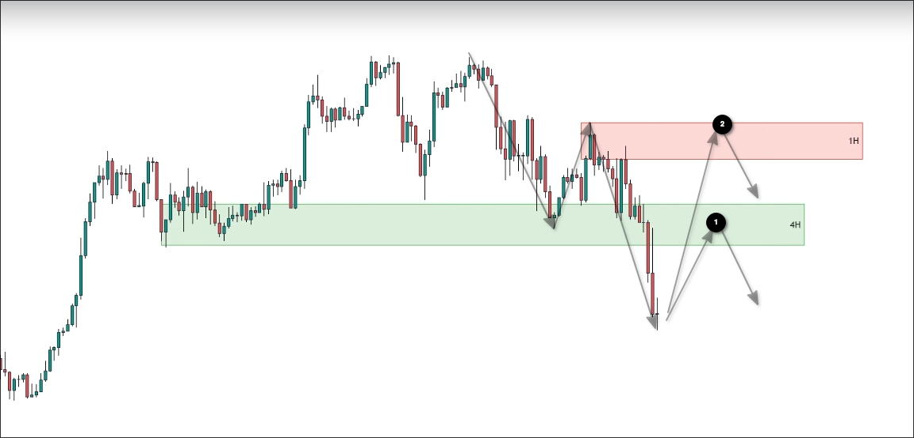
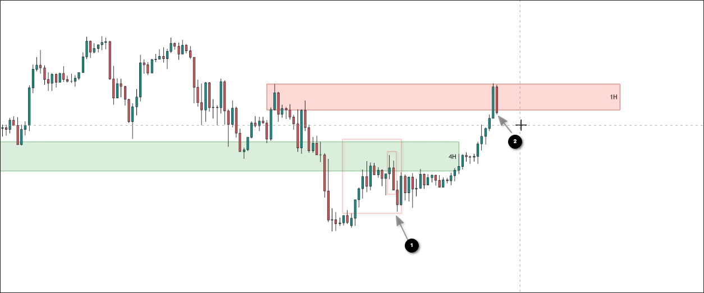
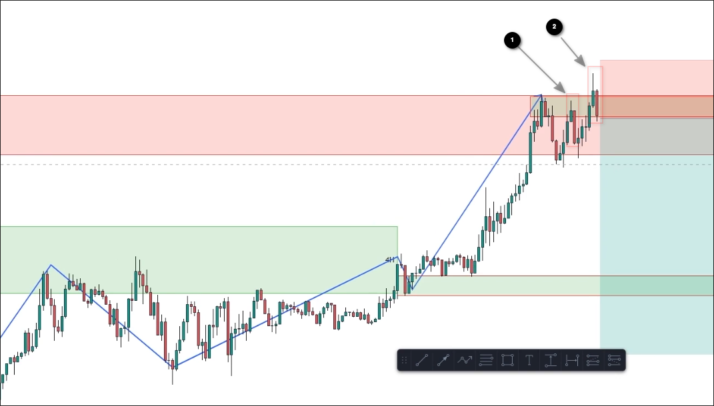
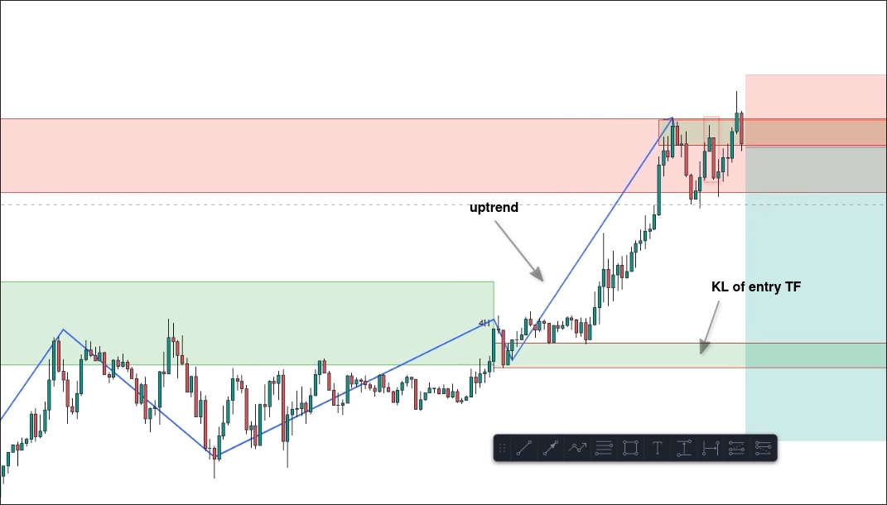

# Live trade 1: Confluence strategy

## Trend TF analysis

In the above chart, we can see that the key level of the uptrend has been broken, so currently the trend on the timeframe is downtrend.

## Trading TF

Then, we can switch to the trading timeframe to see the market structure and the key levels again.

In the above picture, we have drawn the market structure and key levels of the trading TF. Currently, there are two high probability possibilities for the price.
1. retest to the key level of trend TF and then continue to the downside
2. retest to the key level of trading TF and then continue to the upside

## Wait for the price action

I don't know why the instructor completely ignored 1. and only switched to entry TF to find entry points when 2.

## Switch to entry TF to find entry point / stoploss point

I don't understand why we have to wait for the third top to enter the market, when the second top already has a perfect engulfing pattern.

## Risk managment

We also need to draw out the market structure of entry TF.

It can be seen that the entry TF is currently in an uptrend, however the trend TF and trading TF are both in a downtrend, so we should follow the downtrend direction for trading. However, after entering the market, when the price reaches the up KL of the entry TF, risk management should be done.

## Take profit

Regarding Take profit, we can use the recent low of the trading time frame to determine a suitable take profit price.
