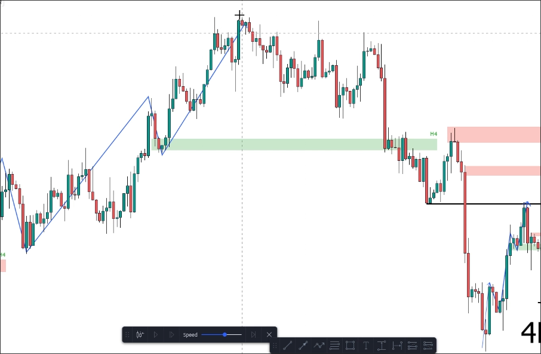
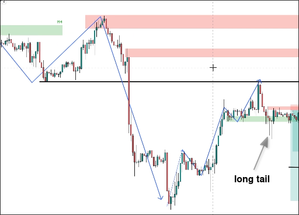
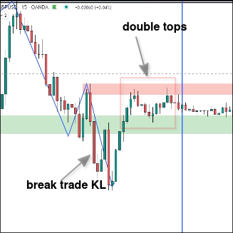

# Live trade 2: Confluence strategy

## Trend TF

It can be seen that the price has already broken through the KL of the first half uptrend, so it is currently in a downtrend.

It can be observed that there are clear signs of a significant retracement when the price reaches a recent low.

## Trading TF

Switching to the trade TF, you can see that the pullback wave has a market structure of higher high and higher low. Although the KL in the process has been crossed, it was only crossed by a long tail, so it is not certain whether the pullback wave has ended.

## Entry TF

Switching to entry TF, we can see that the pullback of trade TF has already been broken, and double tops have been formed at the KL of the downtrend on entry TF. Therefore, we can use entry TF to plan entry and stoploss prices.

## Take profit

We can use the recent low near the trade TF as the take profit price.

