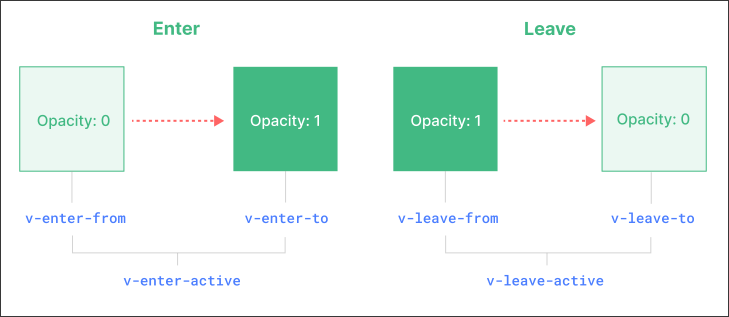

# Component Transition

Vue.js provides a component `<Transition>` that allows you to apply transition effects when elements enter or leave the DOM.

[Official Documentation](https://vuejs.org/guide/built-ins/transition) is very long and detailed. But it's actually very simple than it looks.

There are three cases you can wrap a component with `<Transition>`:
1. component with `v-if`
2. component with `v-show`
3. dynamic component `<component>`

We wrap a component (one of the above) with `<Transition>` and set the transition classes:



```css
/* `-active` is for defining the process of entering/leaving */
.v-enter-active,
.v-leave-active {
  transition: opacity 0.5s ease;
}

/* `.v-enter-from` and `.v-leave-to` are for defining the initial/final state of the element style */
.v-enter-from,
.v-leave-to {
  opacity: 0;
}
```

The above CSS classes are the default classes. You can also use `name` attribute to set your own class names.

```vue
<template>
  <Transition name="fade">
  <!--        ^^^^^^^^^^^ -->
    <div v-if="show">Hello</div>
  </Transition>
</template>

<style scoped>
.fade-enter-active, /* replace .v with .fade because of name="fade" */
.fade-leave-active {
  transition: opacity 0.5s ease;
}
.fade-enter-from,
.fade-leave-to {
  opacity: 0;
}
</style>
```

Apart from `opacity`, you can use any CSS property to create a transition. Here is an example:

```vue
<template>
  <Transition name="slide">
    <div v-if="show">Hello</div>
  </Transition>
</template>
<style scoped>
.slide-enter-active,
.slide-leave-active {
  transition: transform 0.5s ease;
}
.slide-enter-from,
.slide-leave-to {
  transform: translateY(-100%);
}
</style>
```

But remember not to overuse animation on the same page, as this will make the page very heavy.

If two elements enter or leave at the same position (usually in the case of dynamic components), you will find that one element's animation will wait for the other element's animation to complete before starting, causing both elements to be briefly rendered on the screen at the same time, causing layout break issues. We can solve this problem by using the `mode` attribute.

```vue
<template>
  <Transition name="fade" mode="out-in">
  <!--                    ^^^^^^^^^^^^^ `out-in` means the first element will leave before the next element enters -->
    <component :is="currentComponent" />
  </Transition>
</template>
...
```
`mode="out-in"` resolves the problem of layout break.


