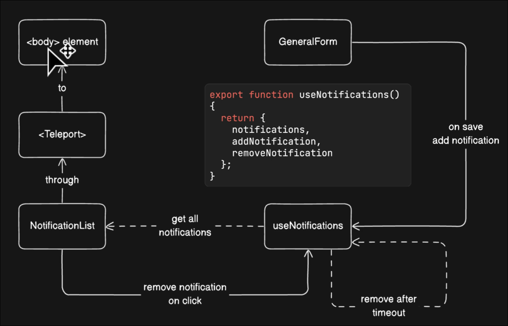

# Design diagram of presenting notifications

Here is a design diagram for a notification system. The purpose of this system is to display a notification to the user after submitting a form, and automatically disappear after a certain period of time.

- We will create a composable to manage the shared state 'notifications'.

- When the user clicks the submit button, the notification will be added to the notifications array, and then the component `NotificationList` will use the notifications array to render the notification list.

- The component `NotificationList` will be `<Teleport>` to `<body>`, so that notifications can be displayed using absolute positioning relative to the body.

- The value in state `notifications` can be deleted by clicking to trigger the method `removeNotification`. If no click event occurs, the added notification will also be automatically deleted after a period of time triggers `removeNotification`.

