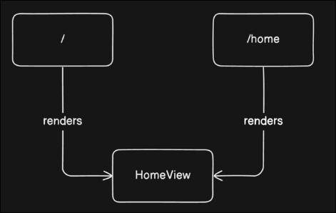

# Alias and Redirect Route

Sometimes you may want to lead multiple different paths to the same view. There are two methods to achieve this: Alias and Redirect Route.

## Alias

```ts
{
    path: '/'
    name: 'home'
    component: HomeView,
    alias: '/home' // if there are more than one alias, use an array
                   // alias: ['/home', '/home2']
},
```


But this way is not good for SEO because there are two different URLs for the same content.

## Redirect

```ts
{
    path: '/'
    name: 'home'
    component: HomeView,
},
{
    path: '/home'
    redirect: '/'  // redirect to the home route
},
```


This way is better for SEO but not good for user experience.


