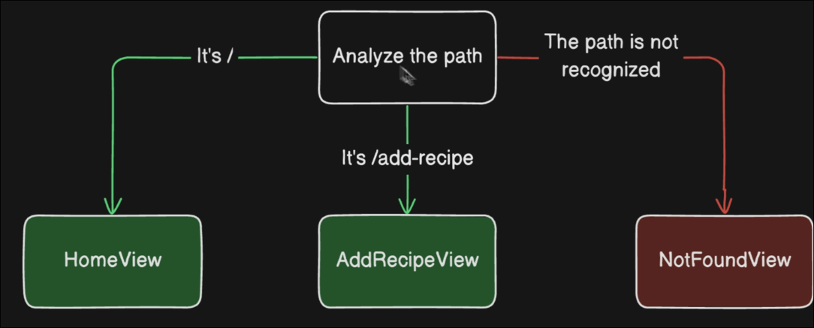

# Vue Router setup

## Basic concept

Router will analyze the URL and route the user to the correct component based on the `path`



## Setup
```ts
// src/router/index.ts
import { createRouter, createWebHistory } from 'vue-router'
import HomeView from '../views/HomeView.vue'

const router = createRouter({
//             ^^^^^^^^^^^^ used to create Vue plugin based on configurations
  history: createWebHistory(import.meta.env.BASE_URL),
  //       ^^^^^^^^^^^^^^^^ ^^^^^^^^^^^^^^^^^^^^^^^^ if not set `base` in the vite.config.ts, it will get domain
  //       ^^^^^^^^^^^^^^^^ there are two type of history, default is HTML5, which is better for SEO
  //                        another one is Hash, it should add # in front of path, so it's bad for SEO but not to set config
  routes: [
    {
      // each route require two properties `path` and `component`
      path: '/',
      name: 'home', // optional, sometimes it's convenient with name, for example of redirect
      component: HomeView,
    },
    {
      path: '/about',
      name: 'about',
      // route level code-splitting
      // this generates a separate chunk (About.[hash].js) for this route
      // which is lazy-loaded when the route is visited.
      // simply put, it will not load the component until the user visit this route,
      // it might take a while when the user visit first time but it will save the memory
      component: () => import('../views/AboutView.vue'),
    },
  ],
})

export default router
```

```ts
// src/main.ts
// ...
import App from './App.vue'
import router from './router'

const app = createApp(App) // create Vue application

app.use(router) // install plugin
// ...
```

Some projects will have a fixed path after the domain, such as `/app`. In this case, we need to go to vite.config.ts to make the configuration.

```ts
// ...

// https://vite.dev/config/
export default defineConfig({
  base: '/app',
  // ...
})
```

In this case, `import.meta.env.BASE_URL` will get `<domain>/app`, and then Vue Router will use the path after `/app` to determine which component to render.


