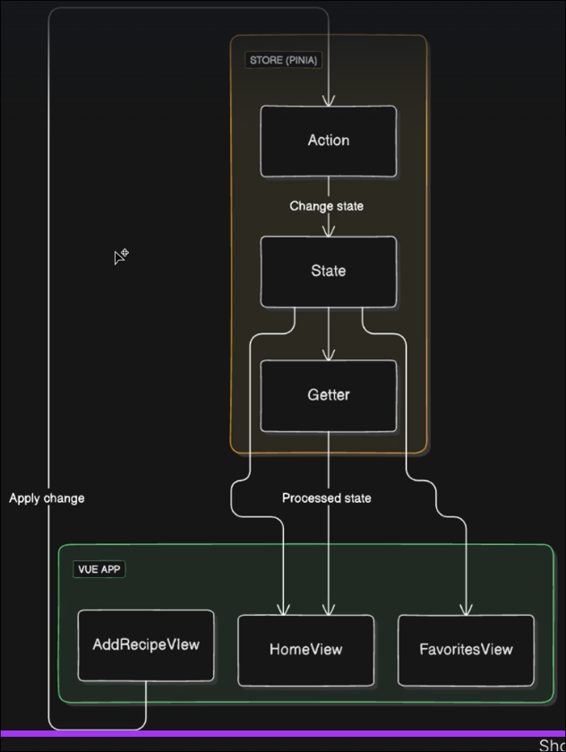

# Pinia store architecture

We can use pinia method `defineStore` to define a store.

Store has below architecture units:
- **state**: usually we use `ref` to define state
- **getters**: computed properties that depend on state, or a function that returns a value based on state
- **actions**: function to modify state

Here is an example of a store:

```ts
import { defineStore } from 'pinia';

export const useCountStore = defineStore('count', () => {
//                                       ^^^^^^^ name of the store

    // state
    const count = ref(0);

    // actions
    function increment() {
        count.value++;
    }
    function decrement() {
        count.value--;
    }

    // getters
    const doubleCount = computed(() => count.value * 2);

    // return state, actions and getters from setup function (2nd argument of defineStore)
    return { count, increment, decrement, doubleCount };
})
```




