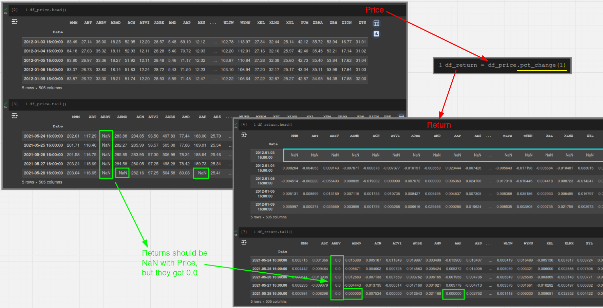
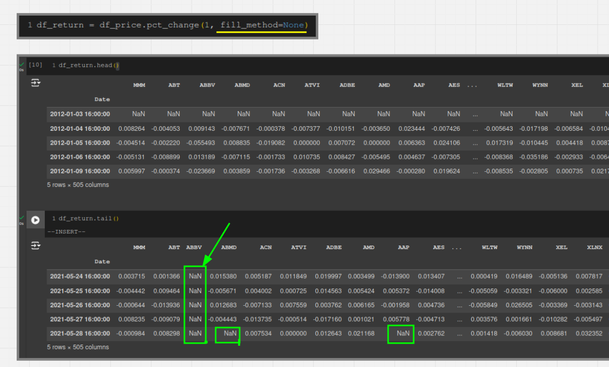

# Trap: Price To Return

When calculating with Pandas, NaN will be ignored but 0.0 will not, so the result above will produce errors compared to the expected result.

However, we can use the parameter fill_method=None of .pct_change() to solve this problem.

