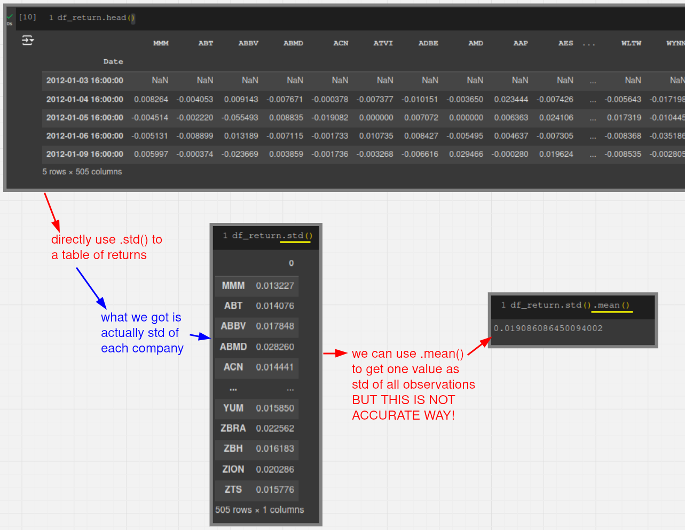
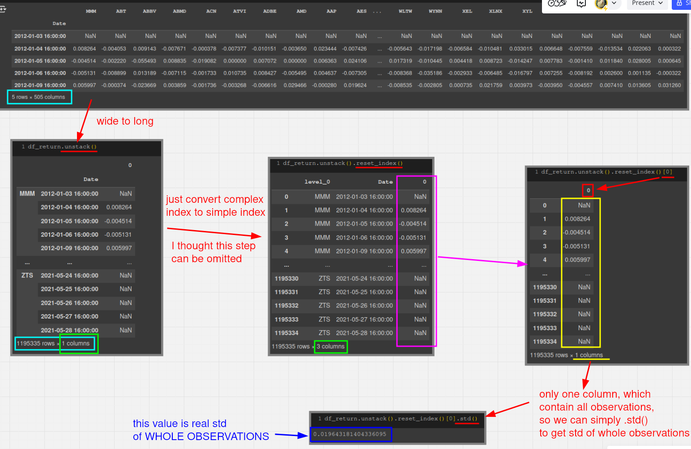

# Calculate Standard Deviation of 2D returns

## NOT ACCURATE way to get the standard deviation of 2D returns

## ACCURATE way to get the standard deviation of 2D returns

# Compare the results

Although the error of the former method may seem small, considering that it needs to be annualized, this error will be magnified significantly. Therefore, it is still best to use the latter method to calculate the standard deviation.

