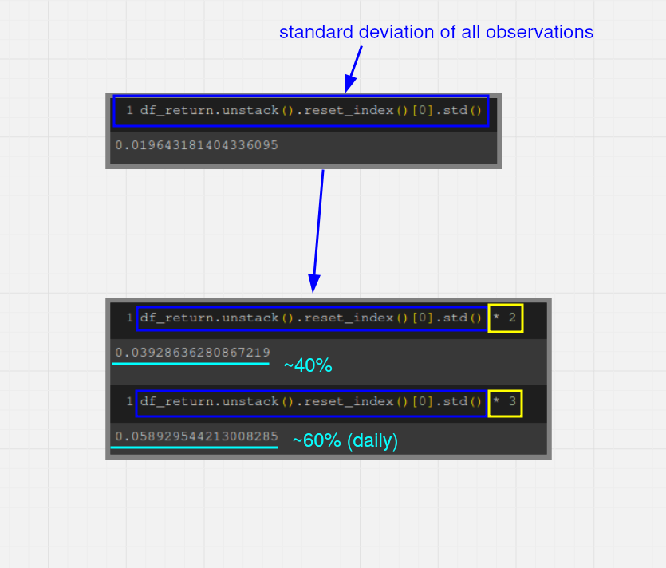

# Outline

## Definition
Twice or three times the [[2024-10-04_Calculate-Standard-Deviation-of-2D-returns|Standard Deviation]], we call it an **outlier**.

## For scientists, statisticians
Observations that exceed the outlier threshold will definitely be removed by them.

## For investors
For professional investors, removing observations is an extremely counterintuitive operation.

In the case shown in the above figure, the outliers we calculated were daily increases of approximately 40 or 60. Such increases are not uncommon in the stock market, and removing observations based on this outlier questioning would actually make our data further from reality.

