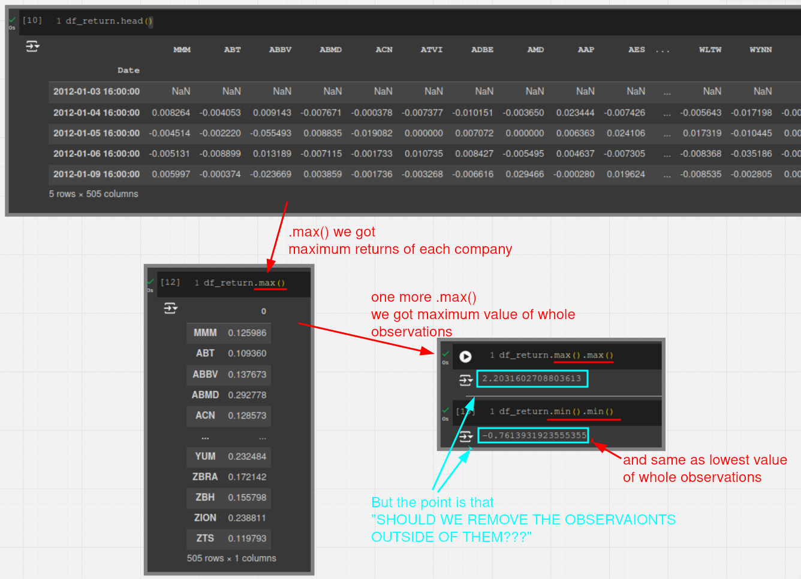

# Should We Remove Observations Outline

If it is a statistician, they will remove all observations that are more than two or three standard deviations (Aka. [[2024-10-04_Outline|Outline]]) away.

However, for those of us who are truly long-term research investors. Although returns usually tend towards zero, no matter how many external observations are removed, we will feel that our data is starting to deviate from reality.

**Therefore, the lecturer's actual practice is not to remove any observations.**
