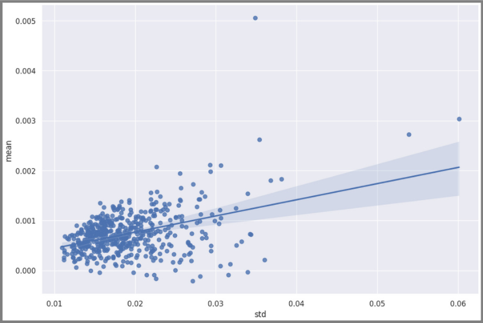

# Expected return and risk have propotion relationship

```python
plt.figure(figsize=(12, 8))
sns.regplot(x=summaries['std'], y=summaries['mean'])
```




We can see trends from [[2024-10-05_Levels-of-random-are-different-from-different-securities|the return graphs of multiple securities]], but we still need to find a way to integrate them into a single graph to see the trend (as shown above). Only then can we actually draw conclusions and further analyze.
