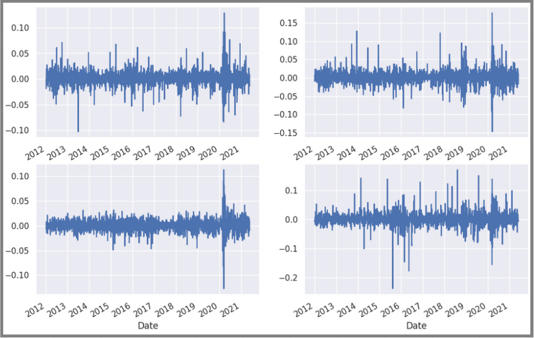

# Levels of random are different from different securities

```python
fig, axes = plt.subplots(2, 2, figsize=(12, 8))
df_return['ACN'].plot(ax=axes[0, 0])
df_return['ADBE'].plot(ax=axes[0, 1])
df_return['XEL'].plot(ax=axes[1, 0])
df_return['ZBRA'].plot(ax=axes[1, 1])
```


Even if the return of an [[2024-10-05_Returns-of-single-security-is-totally-random|individual security is random]], when we compare the returns of multiple securities, we can observe that the randomness varies between different securities, enabling us to develop investment strategies.

But we can get the final conclusion from multiple plots, we need to combine them into [[2024-10-05_Expected-return-and-risk-have-propotion-relationship|a single plot]] to see if there is any pattern.
