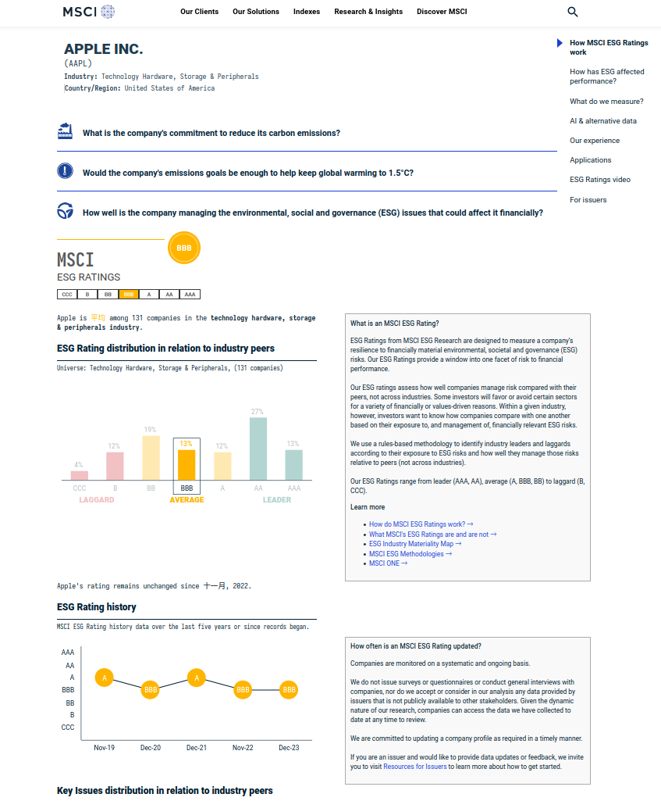
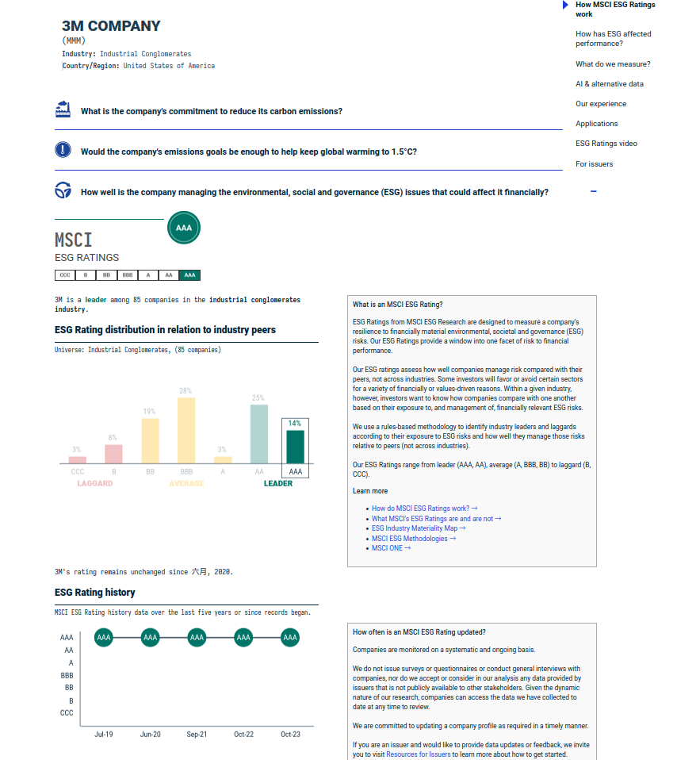

# Check MSCI to prove that ESG change slightly

From the change charts of the ESG of the two companies above, we can see that there is a change in ESG, but it is not significant. Therefore, we can say that the change in ESG is minimal.

