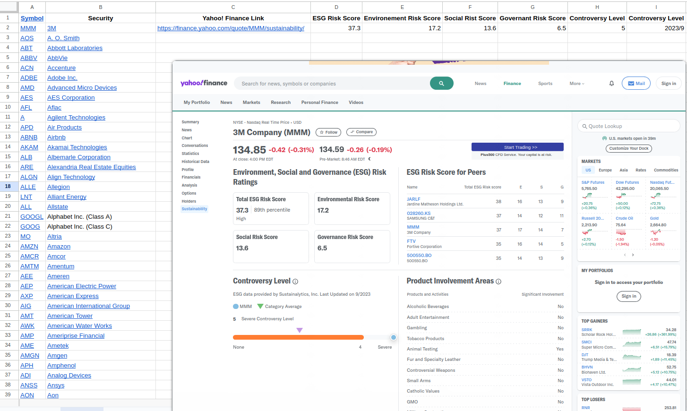
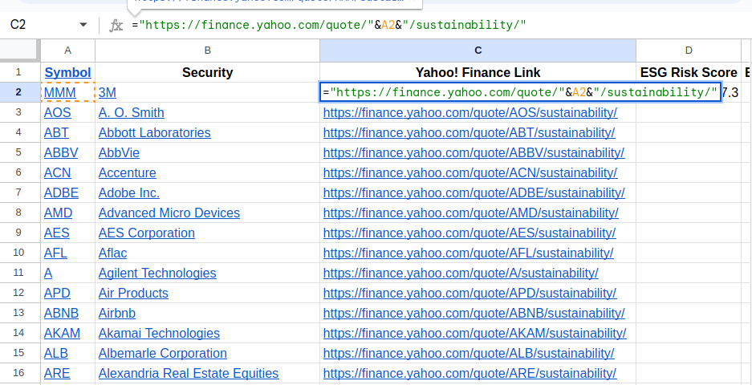
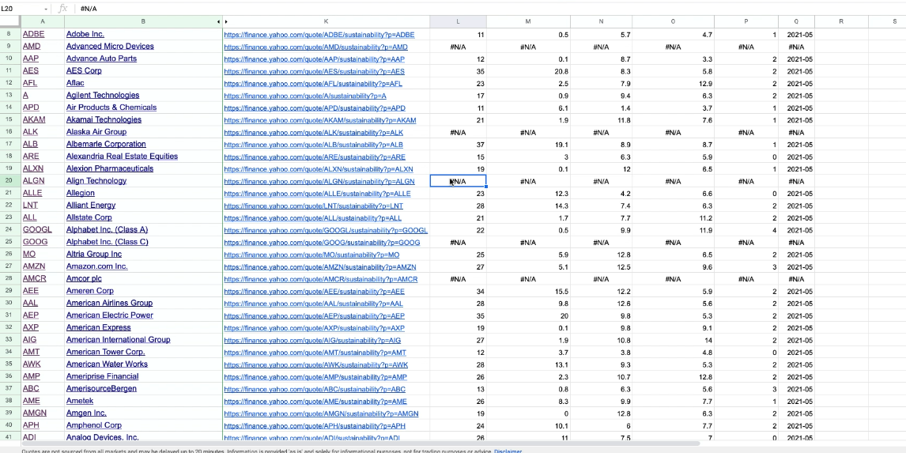

# Collect ESG Risk data to Google sheet

**Tickers**

Just copy the wiki table and paste it into the sheet, leaving the symbol(#ticker) and #security name.

**ESG Risk data**

Yahoo! Finance doesn't allow us to download ESG data or scrap it. We have to key in the data manually.

**Tip to URL links of different securities**

We can quickly generate different security URL links using the above method, but not every link's webpage exists or the webpage exists but does not have any data.

**How about data loss?**

- For missing data, we must use `#n/a` as shown in the above picture.

- Even though there are many ##n/a, there is still enough data in this case to help us result conclusions.
