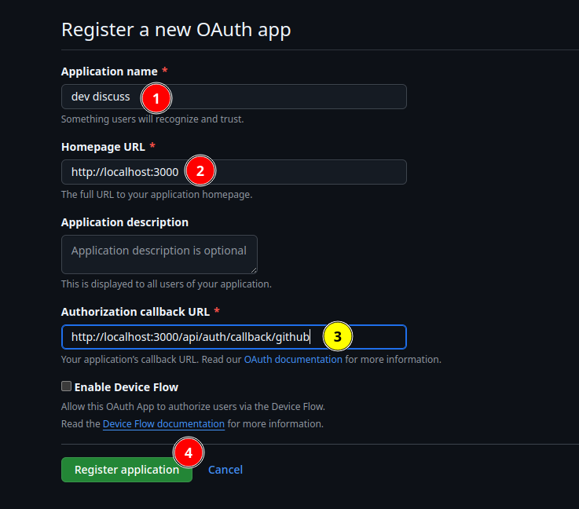
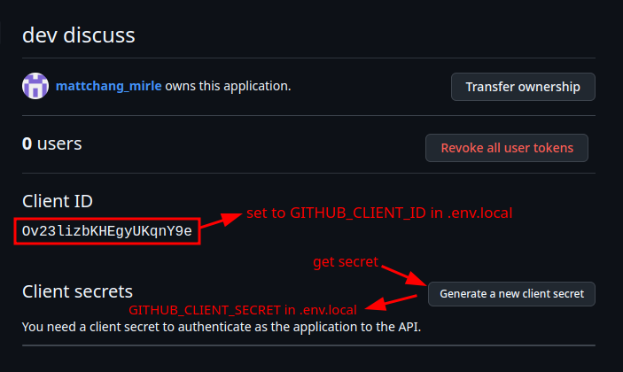

# Create Github OAth app
 
**1. Create a new Github OAth app**

Go to [https://github.com/settings/applications/new]



And collect client id and secret for project setup.




**2. Create a new .env.local file in the root of the project**

```bash
# .env.local 
GITHUB_CLIENT_ID="Ov23lizbKHEgyUKqnY9e"  # from Github OAth app client id
GITHUB_CLIENT_SECRET="a3d7aee7cc7946086ea754a57079b0f328cd7706" # from Github OAth app client secret
AUTH_SECRET="dlkajaksdjhfkjahsiufhiuwebuiah" # random string for jwt token
```

