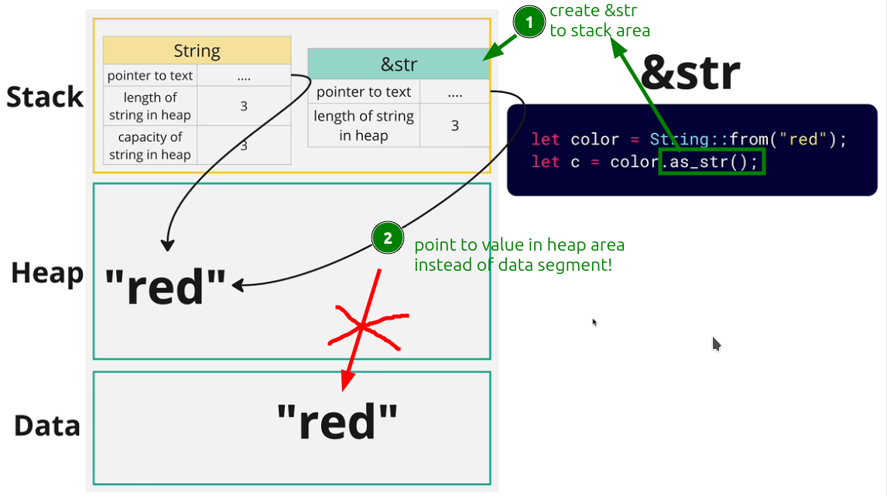

# Memory distributions of different string types

There are [[2024-11-14_Multiply-String-types-in-Rust|multiply String types in Rust]], and they have different [[2024-11-14_Three-area-of-computer-memory|memory distributions strategy]] as below:

