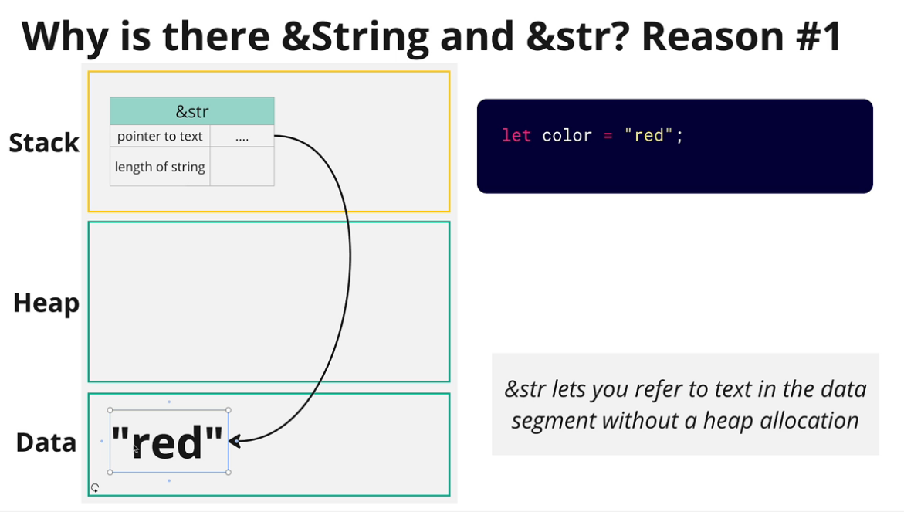
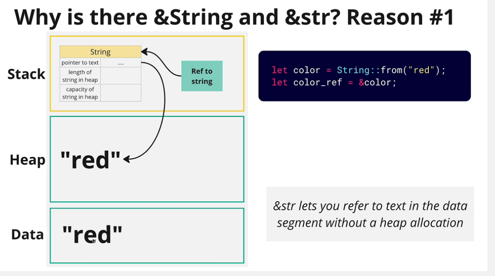
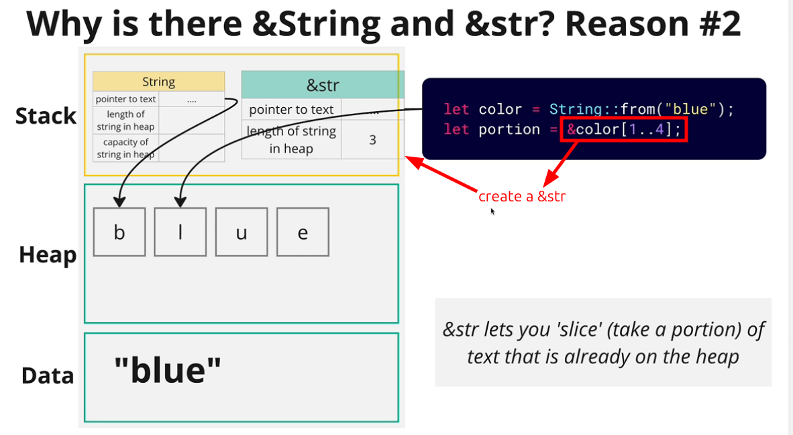
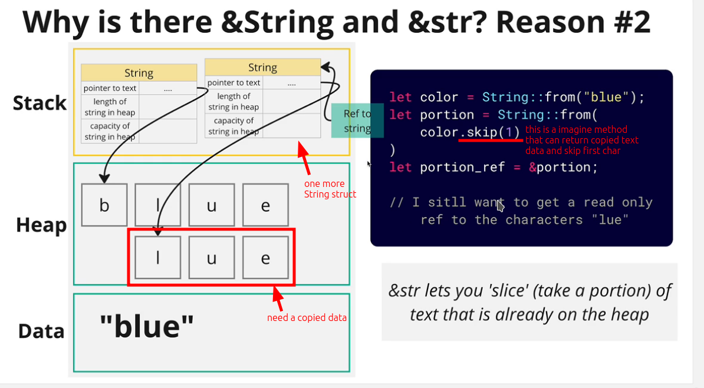

# Why is there &String and &str?

`&String` exists because we want read-only references to `String` values, but it is not efficient.

That's why `&str` exists, which is a read-only reference to text data, and it is more efficient than `&String`.

## Reason 1: &str is more efficient than &String

Assuming we cannot use `&str`, but we still want to generate a read-only reference to text data:

It is obvious that `&str` is much more efficient than `&String`.

## Reason 2: &str can `slice` existing text data in heap

If we want to slice a text data in heap but without using `&str`:

Without `&str`, it is obvious that the whole process is much more complex and less efficient.

## Conclusion

Using the knowledge above, we can conclude [[2024-11-14_When-to-use-String,-&String-or-&str?|when to use String, &String or &str]].
