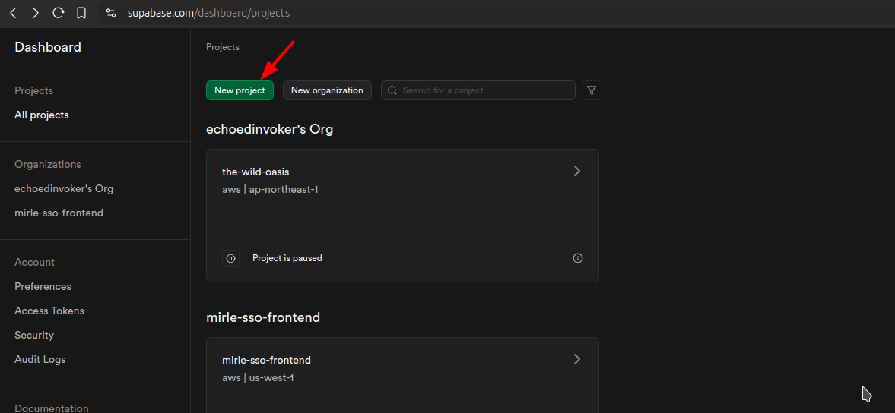
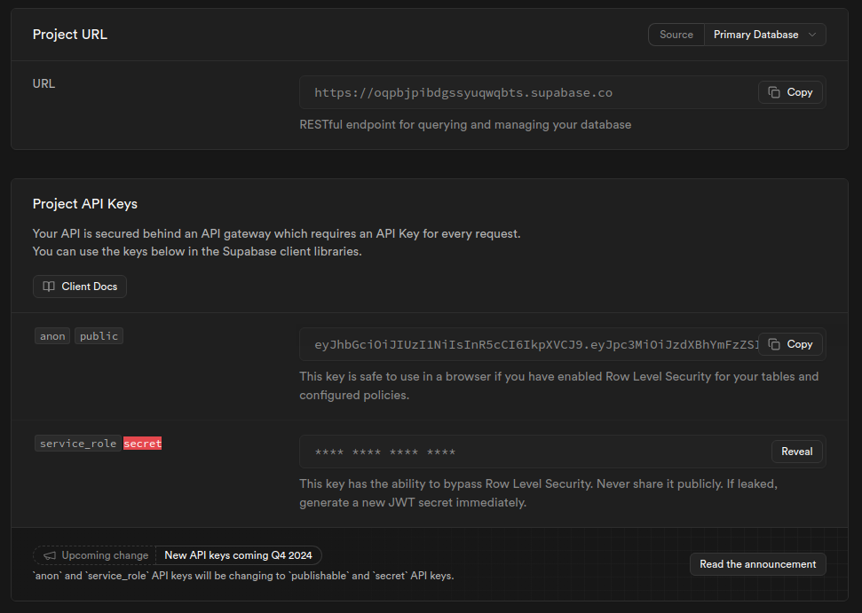
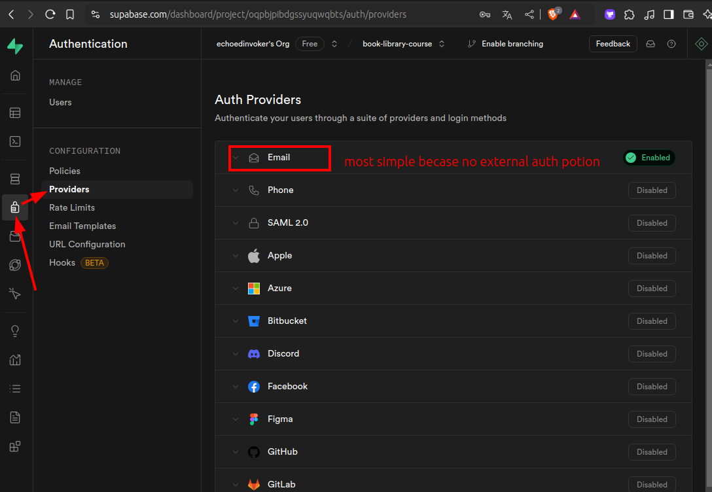
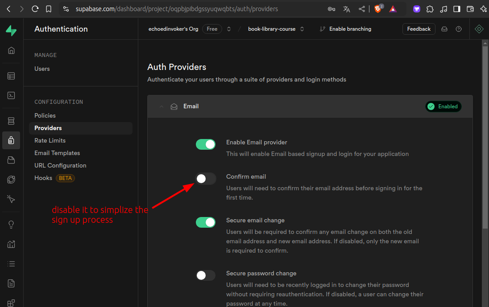

# Create Superbase project and get required variables for Book Nest

In the enpoint of [[2024-12-09_Complete-the-auth-form-errors-presentation-of-Book-Nest|this topic]], it still lacks the authentication part. We want to use Supabase for this. So, we need to create a project on the Supabase and get the required variables and put them in the `.env` file.

Supabase is just a Postgres database with lots of features like authentication, storage, etc. It is a great tool for the projects that need a database and authentication.







Get the variables above and put them in the `.env` file.

```bash
# .env

PUBLIC_SUPABASE_ANON_KEY=xxxx...
SUPABASE_SERVICE_ROLE_KEY=xxxx... # only this is secret. So we use private env to store it.
PUBLIC_SUPABASE_URL=https://oqpbjpibdgssyuqwqbts.supabase.co

# two public variables above are for the client-side usage. So, they are public.

```

Got to `authentication / Providers` page of Supabase dashboard and disable the email confirmation in the `Email` provider (just for easy testing purposes).





Above figure shows that we disable email confirmation so that we can use any email to sign up and login without confirmation, which is easy for testing purposes. And don't forget to click the save button after that...

And you see that Supabase supports lots of external providers. So, we can implement the social login feature easily, too. (a bit harder than email login because there are external processes based on the provider).

