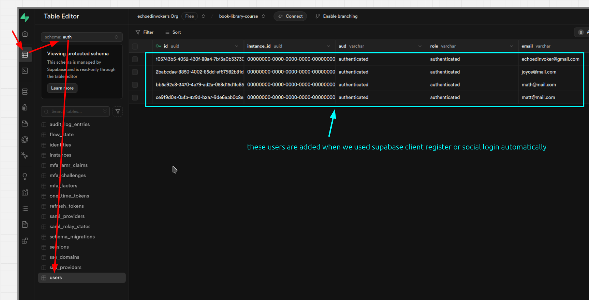

# Create a public table on Supabase to track auth users table

In Supabase, we can see that the users we created using the Supabase client are saved in auth.users, as follows:

But we also want to create a table in the public schema to track changes in auth.users. The benefit of this is that we can directly query this table using the frontend without needing to retrieve data through the backend.

The main reason we can confidently allow the frontend to access this table is because Supabase tables provide Row Level Security (RLS). This way, we can set permissions so that even though this table stores data for all users, we can set it so that logged-in user can only see or update their own data.

So far, this table has been set up on the Supabase dashboard, but it will not automatically increase records as the auth.users record increases (but it will for deletions), so we must handle the issue of adding new records to this table at the appropriate location in our app.

