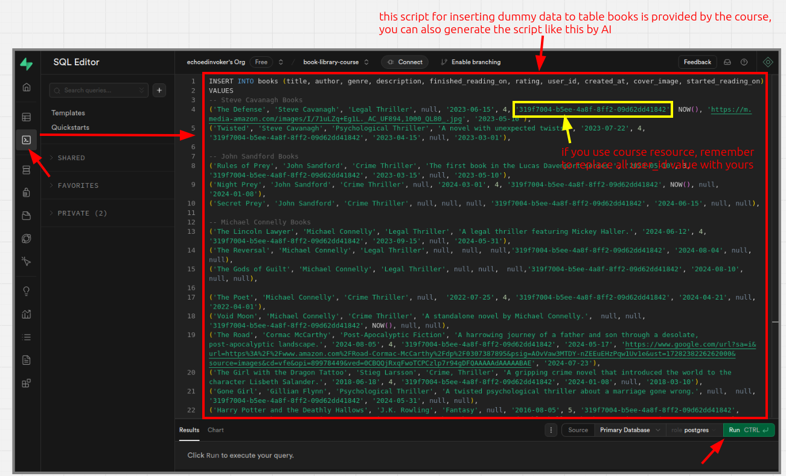
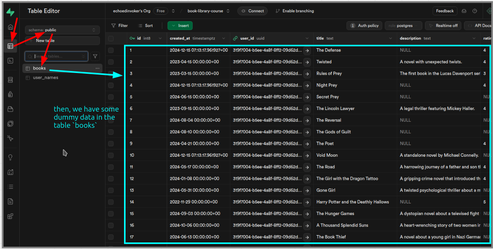

# Insert dummy data to a table on supabase

We use the same feature of supabase dashboard as in [[2024-12-15_Clear-the-table-on-the-supabase-and-prove-cascade-rule-works|this topic]], but instead of clearing the table, we insert some dummy data to the table here.

